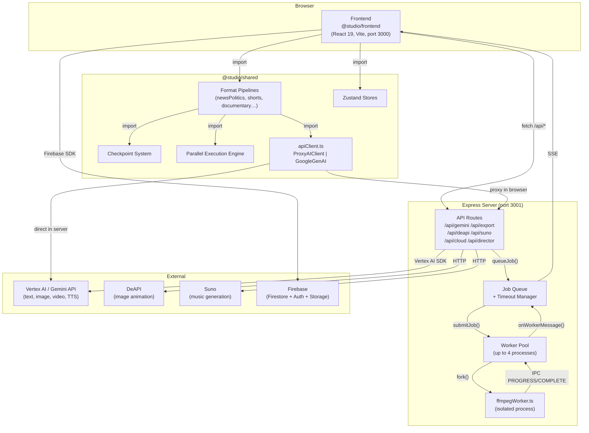
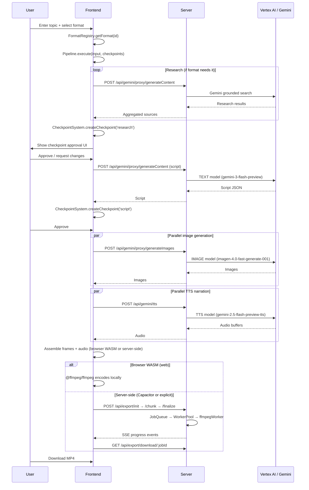

# Architecture Overview

**Last Updated:** 2026-03-26
**Stack:** React 19 + Express 5 + Vite + pnpm workspaces + Firebase + Gemini/Vertex AI + FFmpeg

---

## 1. High-Level System Diagram



---

## 2. Monorepo Packages

```
packages/
├── frontend/     @studio/frontend   React SPA
├── server/       @studio/server     Express REST API + FFmpeg workers
└── shared/       @studio/shared     Business logic (isomorphic)
```

### @studio/frontend

React 19 SPA bundled by Vite (port 3000). React Router v7 handles client-side navigation.

Key directories:

| Directory | Contents |
|---|---|
| `screens/` | Top-level route screens (Studio, Projects, NewProject) |
| `components/` | Reusable UI (TimelinePlayer, FormatSelector, VideoPreviewCard, CheckpointApproval) |
| `hooks/` | React hooks including `useStoryGeneration`, `useFormatPipeline` |
| `router/` | Route definitions (`routes.ts`) and router setup (`index.tsx`) |

Path aliases resolve `@/services/*`, `@/stores/*`, `@/types/*` etc. to `packages/shared/src/`, and `@/*` (catch-all) to `packages/frontend/`. Order matters — the specific patterns must come before the catch-all.

### @studio/server

Express 5 API server run via `tsx` (no compile step). Handles all AI proxying, video export orchestration, and file management.

Key directories:

| Directory | Contents |
|---|---|
| `routes/` | One file per route group |
| `services/jobQueue/` | JobQueueManager, JobStore, TimeoutManager |
| `services/encoding/` | EncoderStrategy (hardware/software detection) |
| `services/validation/` | Frame sequence and quality validators |
| `workers/` | WorkerPool + ffmpegWorker process |
| `types/` | RenderJob, WorkerMessage, MainMessage types |
| `utils/` | Path helpers, sanitization, temp directory constants |

### @studio/shared

All business logic. Isomorphic — runs in both browser (via ProxyAIClient) and server (via Vertex AI). Exports via `"./src/*": "./src/*"` path mappings.

Key directories:

| Directory | Contents |
|---|---|
| `services/pipelines/` | Format-specific production pipelines |
| `services/shared/` | apiClient, models, retry/circuit breaker |
| `services/ai/` | Supervisor/subagent pattern, storyPipeline, productionAgent |
| `services/ffmpeg/` | Browser-side WASM export pipeline |
| `services/` | checkpointSystem, parallelExecutionEngine, researchService, narratorService, imageService, formatRegistry |
| `stores/` | Zustand stores (appStore) |
| `types/` | Shared TypeScript types |

---

## 3. Full Request Flow: Idea → Export



---

## 4. AI Model Usage

Defined in `packages/shared/src/services/shared/apiClient.ts`:

```typescript
export const MODELS = {
  TEXT:          "gemini-3-flash-preview",         // All LLM text tasks
  IMAGE:         "imagen-4.0-fast-generate-001",   // Scene visuals
  VIDEO:         "veo-3.1-fast-generate-preview",  // Video clip generation
  TTS:           "gemini-2.5-flash-preview-tts",   // Narration (AUDIO modality)
  TEXT_GROUNDED: "gemini-3-flash-preview",         // Research with Google Search grounding
  TEXT_EXP:      "gemini-3.1-pro-preview",           // Deep reasoning tasks
}
```

| Task | Model | Notes |
|---|---|---|
| Script writing | `TEXT` | All format pipelines |
| Research / grounding | `TEXT_GROUNDED` | Google Search grounding enabled |
| Scene image generation | `IMAGE` | `seed` param not supported — removed before calls |
| TTS narration | `TTS` | Language-aware voice (e.g. "Kore" for English) |
| Video clip generation | `VIDEO` | Requires Vertex AI quota |

Server-side uses Vertex AI Application Default Credentials (`gcloud auth application-default login`). Browser-side always routes through the Express proxy — no API key is ever exposed to the client.

---

## 5. Format Pipelines

**Directory:** `packages/shared/src/services/pipelines/`

Each format is a standalone module that exports a `run(input, options)` function. The `FormatRegistry` (`formatRegistry.ts`) holds metadata for all 8+ formats including checkpoint count limits, aspect ratios, and pipeline characteristics.

Available formats:

| Format | File | Description |
|---|---|---|
| News & Politics | `newsPolitics.ts` | Grounded research, authoritative narration |
| Documentary | `documentary.ts` | Deep research, long-form narration |
| Short-form | `shorts.ts` | Fast pace, minimal checkpoints |
| Advertisement | `advertisement.ts` | Brand-focused, visual-heavy |
| Educational | `educational.ts` | Structured script, clear narration |
| Music Video | `musicVideo.ts` | Visual-first, Suno integration |
| YouTube Narrator | `youtubeNarrator.ts` | Talking-head style |
| Movie Animation | `movieAnimation.ts` | Character consistency, multi-shot |

Pipelines use three core shared services:
- `CheckpointSystem` — pause/resume at user-approval gates
- `ParallelExecutionEngine` — concurrent image/audio task dispatch
- `ResearchService` — parallel Gemini grounded queries

---

## 6. Checkpoint System

**File:** `packages/shared/src/services/checkpointSystem.ts`

A `CheckpointSystem` instance is created per pipeline run. Pipelines call `await checkpoints.createCheckpoint('phase', data)` which:

1. Enforces a `maxCheckpoints` limit (from format metadata) — silently auto-approves if exceeded
2. Creates a `CheckpointState` and calls `onCheckpointCreated` to notify the UI
3. Suspends the pipeline with a `Promise` until the user approves, rejects, or the 30-minute timeout fires

The UI calls `approveCheckpoint(id)` or `rejectCheckpoint(id, changeRequest)` to resume or re-run the phase with requested changes. On pipeline cancel/complete, `dispose()` auto-approves all pending checkpoints to prevent promise leaks.

---

## 7. Parallel Execution Engine

**File:** `packages/shared/src/services/parallelExecutionEngine.ts`

Used inside format pipelines to dispatch concurrent AI tasks (image generation, TTS) without overwhelming the API.

Key characteristics:
- Configurable concurrency limit (default 3, pipelines use 3-5)
- Priority queue — higher priority tasks run first
- Per-task timeout + AbortController for cancellation
- Exponential backoff retry (up to 3 attempts)
- Rate limit errors (HTTP 429) re-queue without consuming a retry attempt
- Progress events at each task state transition

---

## 8. State Management

### Zustand Stores

**File:** `packages/shared/src/stores/appStore.ts`

A single consolidated Zustand store with `persist` middleware. Sections:

| Section | Contents |
|---|---|
| Conversation | AI chat history, context, workflow state |
| Generation | Pipeline progress and stage tracking |
| Export | Video export settings and progress |
| UI | Panel/modal visibility, view modes |
| Production | Scene data and playback state |
| Navigation | Route-aware state for persistence |

Story Mode state lives in `storyModeStore` (`packages/shared/src/services/ai/production/store.ts`), separate from the main app store.

### localStorage Keys

All keys use the prefix `ai_soul_studio_`:

| Key | Contents |
|---|---|
| `ai_soul_studio_story_state` | Current story workflow state |
| `ai_soul_studio_story_session` | Session ID |
| `ai_soul_studio_story_user_id` | Firebase UID |
| `ai_soul_studio_story_project_id` | Active project ID |

The `useStoryGeneration(projectId?)` hook resets all story state when `projectId` changes to prevent cross-project data leakage. A `PROJECT_ID_KEY` entry tracks the last active project and triggers a reset when it changes.

---

## 9. Firebase Integration

### Firestore

Used for project persistence (scenes, scripts, narration segments, character profiles). All writes go through `storySync.ts`.

**Critical:** Firestore rejects documents containing `undefined` values. Always sanitize with a JSON round-trip before `setDoc()`:

```typescript
const safe = JSON.parse(JSON.stringify(obj));
await setDoc(ref, safe);
```

### Auth

Firebase Auth provides user identity. `onAuthChange` in `storySync.ts` / `useStoryGeneration.ts` gates cloud save/load operations. `getCurrentUser()` is used before any Firestore write.

### Storage

Firebase Cloud Storage is used for large binary assets (images, audio) via `cloudStorageService.ts`. The `/api/cloud` server route proxies uploads/downloads for server-side operations.

### Auto-save

`debouncedSaveToCloud` debounces Firestore writes to avoid quota exhaustion during rapid pipeline progress updates. `flushPendingSave()` is called before navigation to ensure no data is lost.

---

## 10. Two Rendering Modes

### Browser WASM

**When used:** Web browser (non-Capacitor).

`@ffmpeg/ffmpeg` runs FFmpeg compiled to WebAssembly inside a Web Worker. The pipeline in `packages/shared/src/services/ffmpeg/` handles frame rendering, audio concatenation, and final MP4 assembly client-side.

**Note:** Dev server intentionally omits `Cross-Origin-Opener-Policy` / `Cross-Origin-Embedder-Policy` headers to avoid breaking Firebase Auth popups. This means SharedArrayBuffer is not available in dev, so WASM falls back to non-SABF mode.

### Server-side

**When used:** Capacitor (Android/iOS) WebViews (no WASM support), or explicitly via `sync=false` in the export request.

The frontend uploads rendered frames as JPEG chunks to `/api/export/chunk`, then calls `/api/export/finalize` to queue the job. The server's `WorkerPool` runs FFmpeg natively in an isolated process and streams progress back via SSE. The frontend polls `GET /api/export/events/:jobId` and downloads the result from `GET /api/export/download/:jobId`.

| Aspect | Browser WASM | Server-side |
|---|---|---|
| Transport | No network for encoding | Frame upload + SSE progress |
| Environment | Web browser only | All environments |
| Performance | Limited by browser sandbox | Uses GPU encoder if available |
| Memory | Constrained by browser heap | 8 GB per worker process |
| Recovery | None (page refresh = restart) | Jobs persisted to disk, survive restarts |

---

## 11. Key Design Decisions

### Why shared package is isomorphic

Pipelines, AI service wrappers, and stores are shared between frontend and server so the same pipeline code can be called from either context. `apiClient.ts` detects `typeof window` to switch between `ProxyAIClient` (browser) and `GoogleGenAI` (server). This avoids duplicating pipeline logic while keeping secrets server-side.

### Why job persistence uses the filesystem

Export jobs can take several minutes. Persisting to `{TEMP_DIR}/jobs/*.json` means:
- Server restart does not lose jobs (workers re-queue them)
- No database dependency for a lightweight single-process server
- Job IDs are path-sanitized to prevent traversal attacks

### Why workers are forked processes rather than threads

FFmpeg spawns a child process itself. Isolating the encoding in a separate Node.js process (via `child_process.fork`) gives independent memory limits per job, clean crash isolation (one bad encode cannot corrupt the main server process), and the ability to kill an individual job by terminating its worker.

### Why circuit breaker is module-level state

The circuit breaker in `apiClient.ts` uses module-level variables (`consecutiveFailures`, `circuitOpenUntil`). This means all services sharing the `ai` export share a single circuit breaker. The trade-off is that one quota-exhausted model type can block unrelated calls, but the 30-second cooldown is short enough to be acceptable and prevents request storms on a globally degraded API.

### Vite proxy vs direct API calls

The Vite dev server proxies `/api/*` to `localhost:3001`. In production the same Express server serves the API directly. The frontend never calls Gemini/Vertex/DeAPI directly — this design keeps credentials server-side and makes it easy to add auth middleware to all AI routes in one place.

---

## 12. Developer Setup

```bash
# Prerequisites
node >= 20
pnpm >= 9
ffmpeg installed and on PATH
gcloud CLI authenticated (for Vertex AI)

# Install
pnpm install

# Environment (workspace root)
cp .env.example .env
# Set GOOGLE_CLOUD_PROJECT and/or VITE_GEMINI_API_KEY

# Authenticate Vertex AI (server-side)
gcloud auth application-default login
export GOOGLE_CLOUD_PROJECT=your-project-id

# Run full stack
pnpm run dev:all   # frontend (3000) + backend (3001)

# Tests
pnpm run test:run          # frontend unit tests
pnpm run test:server       # server/shared integration tests
pnpm run test:e2e          # Playwright E2E
```

## Related Documentation

- `docs/services/server-infrastructure.md` — Detailed server internals
- `docs/story-mode-pipeline.md` — Story mode workflow specifics
- `docs/multi-format-pipeline-spec.md` — Format pipeline specification
- `CLAUDE.md` — Project conventions and gotchas
