# Frontend Diagram Source of Truth

**Version**: 1.0  
**Last Updated**: April 2026  
**Package**: `@studio/frontend`

---

## Overview

This document is the single source of truth for all frontend architecture diagrams, component hierarchies, data flow patterns, and structural relationships in AI Soul Studio.

## Table of Contents

1. [Architecture Overview](#architecture-overview)
2. [Application Entry](#application-entry)
3. [Routing Structure](#routing-structure)
4. [Component Hierarchy](#component-hierarchy)
5. [State Management](#state-management)
6. [Data Flow Patterns](#data-flow-patterns)
7. [Screen-by-Screen Diagrams](#screen-by-screen-diagrams)
8. [Component Relationships](#component-relationships)
9. [Hook Dependencies](#hook-dependencies)
10. [Service Integration](#service-integration)

---

## Architecture Overview

### High-Level Architecture

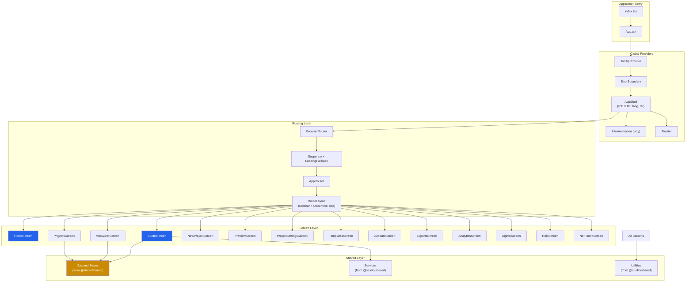

### Layer Responsibilities

| Layer | Responsibility | Location |
|-------|----------------|----------|
| **Entry** | App initialization, global providers | `App.tsx`, `index.tsx` |
| **Routing** | Navigation, route guards, lazy loading | `router/` |
| **Screens** | Page-level components, screen-specific logic | `screens/` |
| **Components** | Reusable UI components | `components/` |
| **Hooks** | Custom React hooks for logic reuse | `hooks/` |
| **Shared** | Business logic, stores, services (from shared package) | `@studio/shared` |

---

## Application Entry

### Entry Point Flow

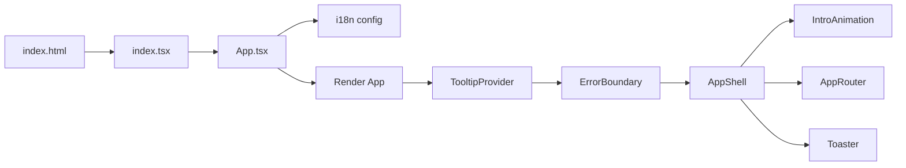

### App Shell Structure

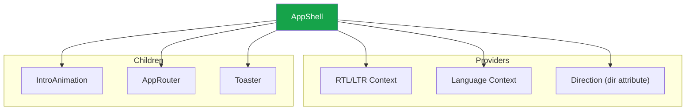

### App Shell Responsibilities

- **RTL/LTR Support**: Manages text direction for Arabic/English
- **Language Context**: Provides current language to all components
- **Error Boundary**: Catches and handles React errors
- **Intro Animation**: Shows cinematic intro on first load
- **Toast System**: Global notification system

---

## Routing Structure

### Route Configuration

```mermaid
graph TD
    ROUTER["AppRouter (BrowserRouter)"]
    SUS["Suspense + LoadingFallback"]
    RL["RouteLayout"]
    
    subgraph PublicRoutes["Public Routes"]
        HOME["/ → HomeScreen"]
        SIGN["/signin → SignInScreen"]
        HELP["/help → HelpScreen"]
        NOTFOUND["* → NotFoundScreen"]
    end
    
    subgraph ProtectedRoutes["Protected Routes (requiresAuth)"]
        PROJ["/projects → ProjectsScreen"]
        NEW["/projects/new → NewProjectScreen"]
        ACCT["/account → AccountScreen"]
        EXP["/exports → ExportsScreen"]
        ANAL["/analytics → AnalyticsScreen"]
    end
    
    subgraph ProjectRoutes["Project Routes"]
        PROJID["/projects/:projectId → redirect to /studio"]
        STORYID["/story/:projectId → redirect to /studio?mode=story"]
        SET["/projects/:projectId/settings → ProjectSettingsScreen"]
    end
    
    subgraph WorkspaceRoutes["Workspace Routes"]
        STUDIO["/studio → StudioScreen"]
        VIZ["/visualizer → VisualizerScreen"]
        PREV["/preview/:projectId → PreviewScreen"]
        TEMPL["/templates → TemplatesScreen"]
    end
    
    ROUTER --> SUS --> RL
    RL --> HOME
    RL --> SIGN
    RL --> HELP
    RL --> NOTFOUND
    RL --> PROJ
    RL --> NEW
    RL --> ACCT
    RL --> EXP
    RL --> ANAL
    RL --> PROJID
    RL --> STORYID
    RL --> SET
    RL --> STUDIO
    RL --> VIZ
    RL --> PREV
    RL --> TEMPL
    
    style RL fill:#2563eb,color:#fff
    style STUDIO fill:#ca8a04,color:#fff
```

### Route Definitions

| Path | Component | Auth Required | Preserve State | Description |
|------|-----------|---------------|----------------|-------------|
| `/` | HomeScreen | No | No | Landing page with mode selection |
| `/projects` | ProjectsScreen | Yes | No | Project dashboard |
| `/projects/new` | NewProjectScreen | Yes | No | New project wizard |
| `/projects/:projectId` | Redirect | Yes | No | Redirects to `/studio?projectId=...` |
| `/projects/:projectId/settings` | ProjectSettingsScreen | Yes | No | Project settings |
| `/story/:projectId` | Redirect | No | No | Redirects to `/studio?projectId=...&mode=story` |
| `/studio` | StudioScreen | No | Yes | Main creation workspace |
| `/visualizer` | VisualizerScreen | No | Yes | Audio visualizer |
| `/preview/:projectId` | PreviewScreen | No | No | Video preview |
| `/templates` | TemplatesScreen | No | No | Template gallery |
| `/account` | AccountScreen | Yes | No | User account |
| `/exports` | ExportsScreen | Yes | No | Export history |
| `/analytics` | AnalyticsScreen | Yes | No | Analytics dashboard |
| `/signin` | SignInScreen | No | No | Authentication |
| `/help` | HelpScreen | No | No | Help & shortcuts |
| `*` | NotFoundScreen | No | No | 404 page |

### Route Layout

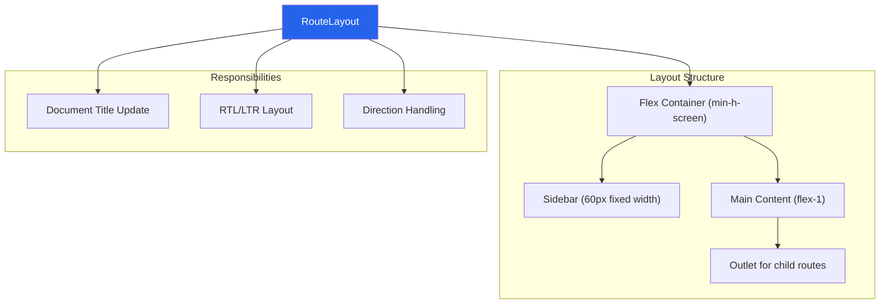

---

## Component Hierarchy

### Overall Component Tree

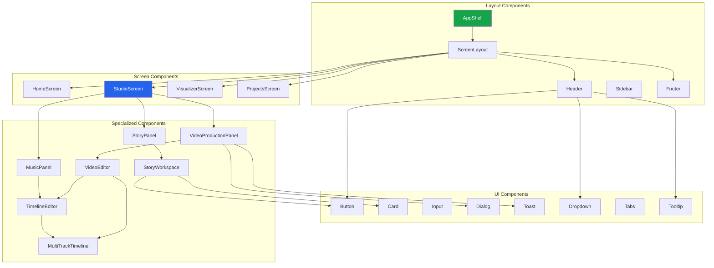

### Component Categories

#### Layout Components
- `AppShell` - Global app wrapper with RTL/LTR support
- `ScreenLayout` - Screen-level layout with header/footer
- `Header` - Top navigation bar
- `Sidebar` - Side navigation strip
- `RouteLayout` - Route wrapper with sidebar

#### UI Components (shadcn/ui)
- `Button`, `Input`, `Textarea`, `Select`
- `Card`, `Dialog`, `Dropdown`, `Tabs`
- `Toast`, `Tooltip`, `Progress`, `Badge`
- `ScrollArea`, `Slider`, `Switch`

#### Specialized Components
- `VideoEditor` - Video editing workspace
- `TimelineEditor` - Timeline editing interface
- `MultiTrackTimeline` - Multi-track timeline
- `StoryWorkspace` - Story creation workspace
- `VideoProductionPanel` - Video production chat interface
- `StoryPanel` - Story mode panel
- `MusicPanel` - Music editor panel

---

## State Management

### Zustand Stores

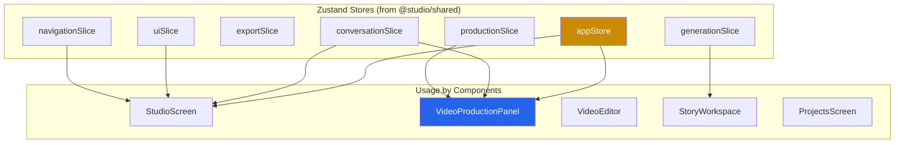

### Store Responsibilities

| Store | Scope | State | Used By |
|-------|-------|-------|---------|
| `appStore` | Global app state | Messages, app-wide settings | StudioScreen, VideoProductionPanel |
| `conversationSlice` | Chat/conversation | Message history, chat state | StudioScreen, VideoProductionPanel |
| `exportSlice` | Export operations | Export queue, export history | VideoProductionPanel, ExportsScreen |
| `generationSlice` | AI generation | Generation progress, results | StoryWorkspace, VideoProductionPanel |
| `navigationSlice` | Navigation | Current route, navigation history | StudioScreen |
| `productionSlice` | Video production | Pipeline state, checkpoints | VideoProductionPanel |
| `uiSlice` | UI state | Modals, panels, UI preferences | StudioScreen, VideoEditor |

### Additional State

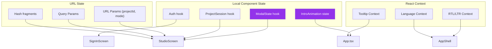

---

## Data Flow Patterns

### Data Flow Overview

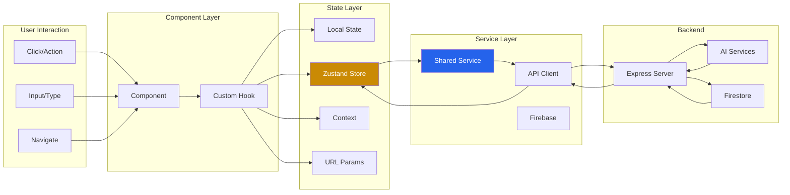

### Pattern 1: User Action → Component → Hook → Store → Service

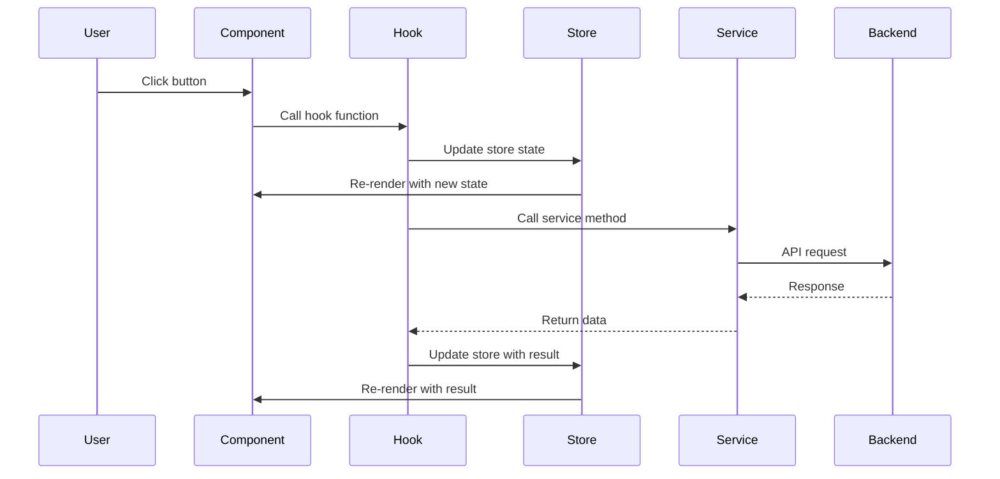

### Pattern 2: URL State → Component → Hook → Service

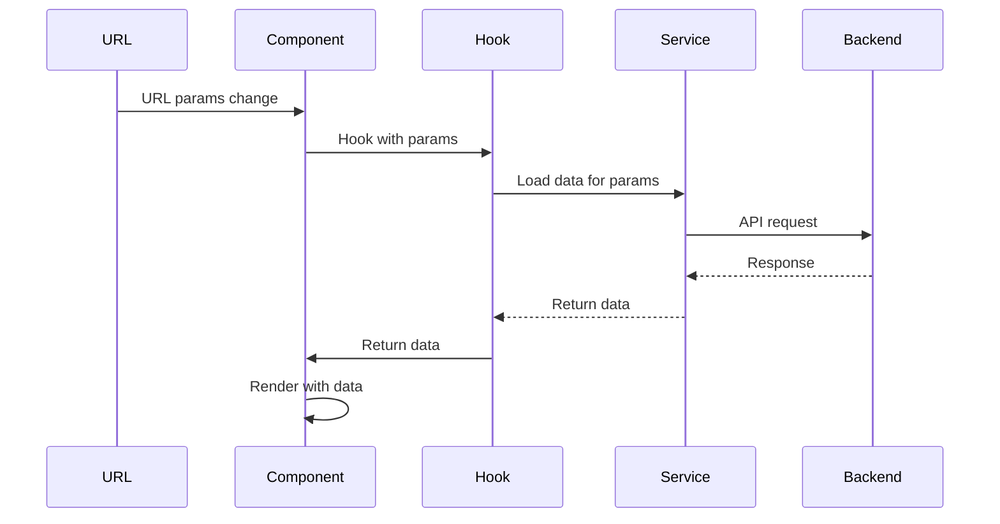

### Pattern 3: Real-time Updates (Firebase)

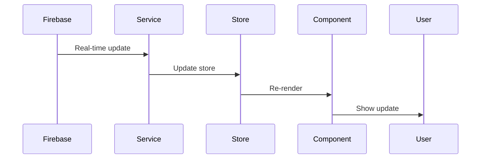

---

## Screen-by-Screen Diagrams

### HomeScreen

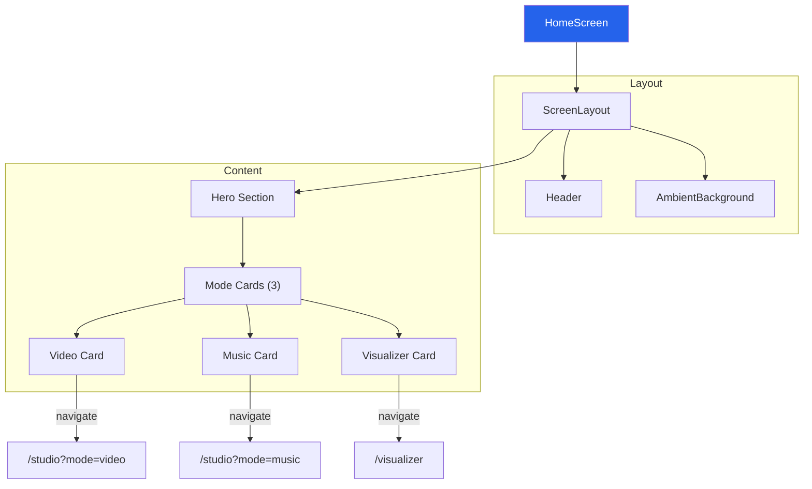

### StudioScreen

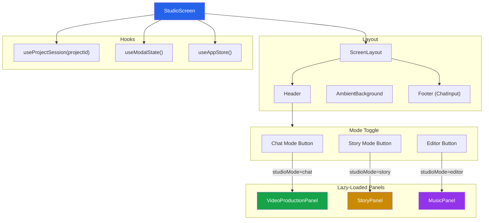

### VideoProductionPanel (Chat Mode)

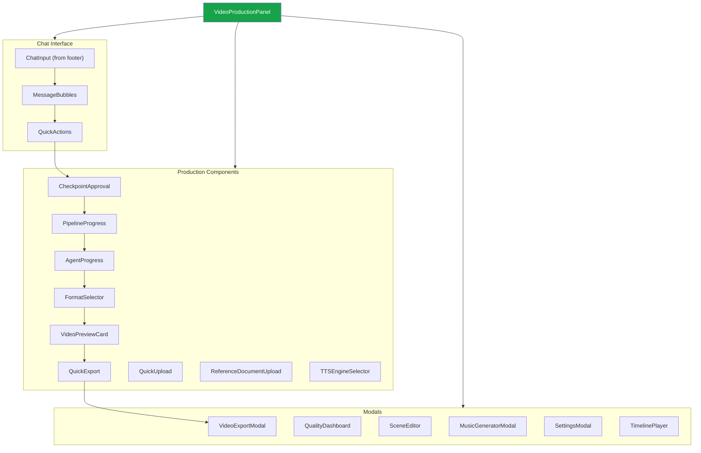

### StoryPanel (Story Mode)

```mermaid
graph TD
    SP["StoryPanel"]
    
    subgraph Workspace["StoryWorkspace"]
        IDEA["IdeaView"]
        SCRIPT["ScriptView"]
        STORYBOARD["StoryboardView"]
        CHAR["CharacterView"]
        SCENE["SceneCard"]
        SHOT["ShotEditorModal"]
        STYLE["StyleSelector"]
        TEMPL["TemplatesGallery"]
        EXPORT["ExportOptionsPanel"]
        VERSION["VersionHistoryPanel"]
    end
    
    subgraph Progress["Progress"]
        BREAK["BreakdownProgress"]
        SB_PROG["StoryboardProgress"]
        STEP["StepProgressBar"]
    end
    
    subgraph Guards["Guards"]
        LOCK["LockWarningDialog"]
        ERROR["StoryWorkspaceErrorBoundary"]
    end
    
    SP --> Workspace
    SP --> Progress
    SP --> Guards
    
    IDEA --> SCRIPT
    SCRIPT --> STORYBOARD
    STORYBOARD --> CHAR
    CHAR --> SCENE
    SCENE --> SHOT
    SHOT --> STYLE
    STYLE --> TEMPL
    TEMPL --> EXPORT
    EXPORT --> VERSION
    
    BREAK --> SB_PROG
    SB_PROG --> STEP
    
    style SP fill:#ca8a04,color:#fff
```

### MusicPanel (Editor Mode)

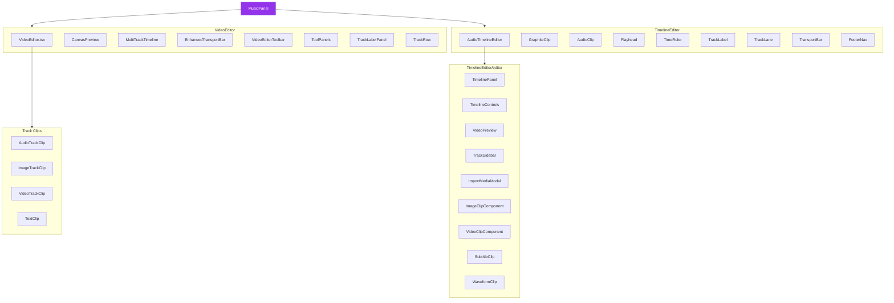

### VisualizerScreen

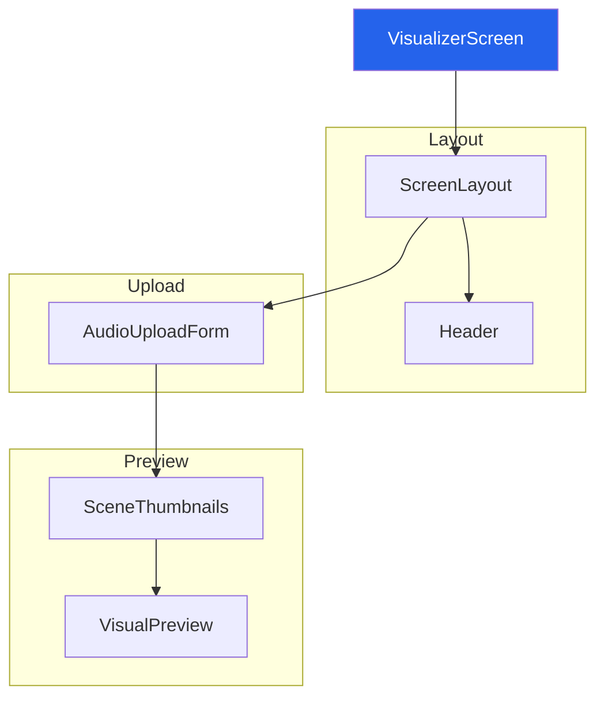

### ProjectsScreen

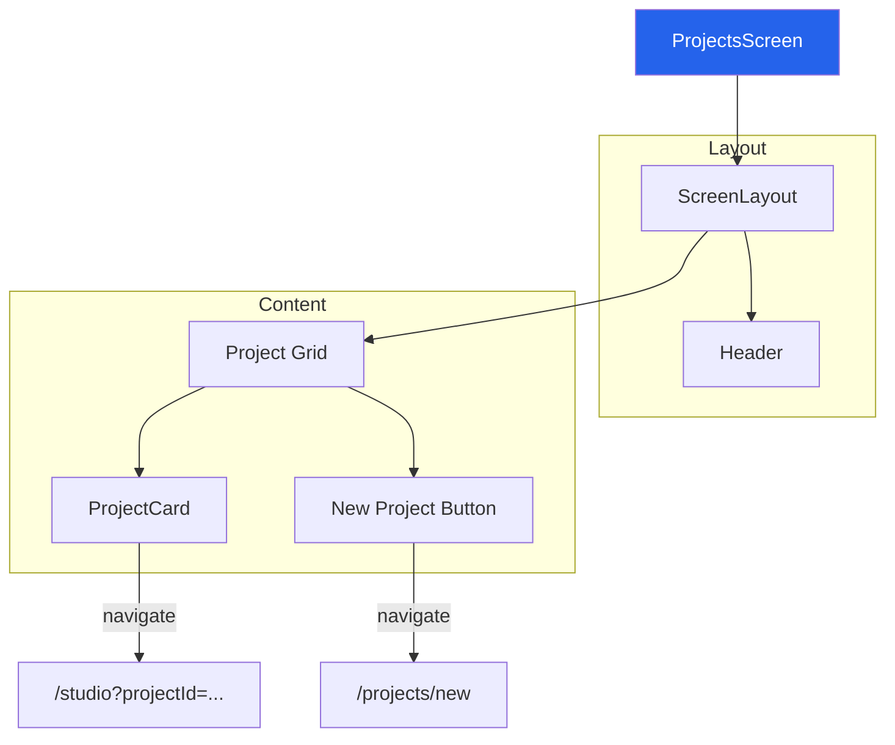

---

## Component Relationships

### Layout Component Dependencies

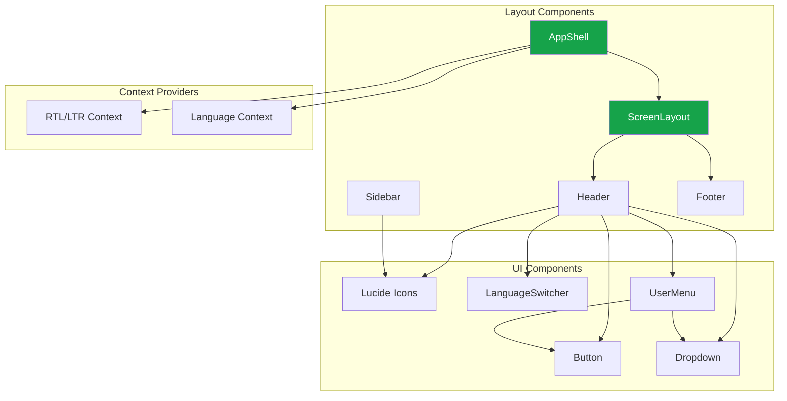

### Video Editor Component Tree

```mermaid
graph TD
    VE["VideoEditor"]
    
    subgraph Layout["Layout"]
        PREVIEW["CanvasPreview"]
        TIMELINE["MultiTrackTimeline"]
        TRANSPORT["EnhancedTransportBar"]
        TOOLBAR["VideoEditorToolbar"]
    end
    
    subgraph Timeline["Timeline Components"]
        TRACKS["Track Rows"]
        LABELS["TrackLabelPanel"]
        CLIPS["Track Clips"]
        PLAYHEAD["Playhead"]
        RULER["TimeRuler"]
    end
    
    subgraph Clips["Clip Types"]
        AUDIO["AudioTrackClip"]
        IMAGE["ImageTrackClip"]
        VIDEO["VideoTrackClip"]
        TEXT["TextClip"]
    end
    
    VE --> PREVIEW
    VE --> TIMELINE
    VE --> TRANSPORT
    VE --> TOOLBAR
    
    TIMELINE --> TRACKS
    TIMELINE --> LABELS
    TIMELINE --> PLAYHEAD
    TIMELINE --> RULER
    
    TRACKS --> CLIPS
    CLIPS --> AUDIO
    CLIPS --> IMAGE
    CLIPS --> VIDEO
    CLIPS --> TEXT
    
    style VE fill:#2563eb,color:#fff
```

### Story Workspace Component Tree

```mermaid
graph TD
    SW["StoryWorkspace"]
    
    subgraph Views["Views"]
        IDEA["IdeaView"]
        SCRIPT["ScriptView"]
        STORYBOARD["StoryboardView"]
        CHAR["CharacterView"]
    end
    
    subgraph Components["Components"]
        SCENE["SceneCard"]
        SHOT["ShotEditorModal"]
        STYLE["StyleSelector"]
        TEMPL["TemplatesGallery"]
        EXPORT["ExportOptionsPanel"]
        VERSION["VersionHistoryPanel"]
    end
    
    subgraph Progress["Progress"]
        BREAK["BreakdownProgress"]
        SB_PROG["StoryboardProgress"]
        STEP["StepProgressBar"]
    end
    
    SW --> IDEA
    SW --> SCRIPT
    SW --> STORYBOARD
    SW --> CHAR
    
    STORYBOARD --> SCENE
    STORYBOARD --> SHOT
    SCRIPT --> STYLE
    IDEA --> TEMPL
    EXPORT --> VERSION
    
    SW --> BREAK
    SW --> SB_PROG
    SW --> STEP
    
    style SW fill:#ca8a04,color:#fff
```

---

## Hook Dependencies

### Custom Hooks Overview

```mermaid
graph TD
    subgraph AuthHooks["Auth Hooks"]
        AUTH["useAuth"]
    end
    
    subgraph ProjectHooks["Project Hooks"]
        PROJ["useProjectSession"]
    end
    
    subgraph ProductionHooks["Production Hooks"]
        VIDEO["useVideoProductionRefactored"]
        NARRATION["useVideoNarration"]
        VISUALS["useVideoVisuals"]
        SFX["useVideoSFX"]
        QUALITY["useVideoQuality"]
        PROMPT["useVideoPromptTools"]
        FORMAT["useFormatPipeline"]
    end
    
    subgraph MusicHooks["Music Hooks"]
        SUNO["useSunoMusic"]
        DEAPI["useDeApiModels"]
    end
    
    subgraph StoryHooks["Story Hooks"]
        STORY["useStoryGeneration"]
    end
    
    subgraph TimelineHooks["Timeline Hooks"]
        ADAPTER["useTimelineAdapter"]
        KEYBOARD["useTimelineKeyboard"]
        SELECTION["useTimelineSelection"]
    end
    
    subgraph UIHooks["UI Hooks"]
        MODAL["useModalState"]
        FOCUS["useFocusTrap"]
        LYRIC["useLyricLens"]
    end
    
    subgraph AppHooks["App Hooks"]
        APP["useAppStore"]
    end
    
    style VIDEO fill:#2563eb,color:#fff
    style STORY fill:#ca8a04,color:#fff
    style SUNO fill:#9333ea,color:#fff
```

### Hook Usage by Components

| Hook | Used By | Purpose |
|------|---------|---------|
| `useAuth` | SignInScreen, AccountScreen | Authentication state |
| `useProjectSession` | StudioScreen | Project persistence & loading |
| `useVideoProductionRefactored` | VideoProductionPanel | Video production pipeline |
| `useVideoNarration` | VideoProductionPanel | TTS narration generation |
| `useVideoVisuals` | VideoProductionPanel | Visual generation |
| `useVideoSFX` | VideoProductionPanel | Sound effects |
| `useVideoQuality` | VideoProductionPanel | Quality settings |
| `useVideoPromptTools` | VideoProductionPanel | Prompt engineering |
| `useFormatPipeline` | VideoProductionPanel | Format-specific pipelines |
| `useSunoMusic` | VideoProductionPanel, MusicPanel | Music generation |
| `useDeApiModels` | VideoProductionPanel | DeAPI model access |
| `useStoryGeneration` | StoryPanel, StoryWorkspace | Story pipeline |
| `useTimelineAdapter` | VideoEditor, MusicPanel | Timeline state management |
| `useTimelineKeyboard` | VideoEditor, MusicPanel | Timeline keyboard shortcuts |
| `useTimelineSelection` | VideoEditor, MusicPanel | Timeline selection |
| `useModalState` | StudioScreen | Modal visibility |
| `useFocusTrap` | Dialogs, Modals | Focus trapping |
| `useLyricLens` | VisualizerScreen | Audio visualization |
| `useModalState` | StudioScreen | Modal state management |

### Hook Dependencies Graph

```mermaid
graph TD
    subgraph Production["Production Hooks"]
        VIDEO["useVideoProductionRefactored"]
        NARRATION["useVideoNarration"]
        VISUALS["useVideoVisuals"]
        SFX["useVideoSFX"]
        QUALITY["useVideoQuality"]
        PROMPT["useVideoPromptTools"]
        FORMAT["useFormatPipeline"]
    end
    
    subgraph Story["Story Hooks"]
        STORY["useStoryGeneration"]
    end
    
    subgraph Shared["Shared Services"]
        API["API Client"]
        FIREBASE["Firebase"]
        STORES["Zustand Stores"]
    end
    
    VIDEO --> API
    VIDEO --> STORES
    NARRATION --> API
    VISUALS --> API
    SFX --> API
    QUALITY --> STORES
    PROMPT --> STORES
    FORMAT --> API
    
    STORY --> API
    STORY --> STORES
    
    style VIDEO fill:#2563eb,color:#fff
    style STORY fill:#ca8a04,color:#fff
```

---

## Service Integration

### API Integration Pattern

```mermaid
graph TD
    subgraph Frontend["Frontend"]
        COMP["Component"]
        HOOK["Custom Hook"]
        STORE["Zustand Store"]
    end
    
    subgraph Shared["Shared Layer"]
        API["ProxyAIClient"]
        SERVICE["Service"]
    end
    
    subgraph Server["Server"]
        ROUTE["Express Route"]
        AI["AI Service"]
    end
    
    COMP --> HOOK
    HOOK --> STORE
    HOOK --> SERVICE
    SERVICE --> API
    API --> ROUTE
    ROUTE --> AI
    AI --> ROUTE
    ROUTE --> API
    API --> SERVICE
    SERVICE --> STORE
    STORE --> COMP
    
    style API fill:#2563eb,color:#fff
    style ROUTE fill:#ca8a04,color:#fff
```

### API Endpoints Used

| Endpoint | Method | Used By | Purpose |
|----------|--------|---------|---------|
| `/api/gemini` | POST | Various hooks | Gemini AI API proxy |
| `/api/deapi` | POST | useDeApiModels | DeAPI model access |
| `/api/suno` | POST | useSunoMusic | Suno music generation |
| `/api/export` | POST | Video export | FFmpeg video export |
| `/api/import` | POST | Project import | Import projects |
| `/api/video` | POST | Video services | Video operations |
| `/api/director` | POST | Director agent | AI director |
| `/api/cloud` | POST | Cloud services | Cloud operations |

### Firebase Integration

```mermaid
graph TD
    subgraph Frontend["Frontend"]
        COMP["Component"]
        HOOK["useProjectSession"]
        STORE["Zustand Store"]
    end
    
    subgraph Shared["Shared Layer"]
        FIREBASE["Firebase Client"]
        AUTH["Firebase Auth"]
        FIRESTORE["Firestore"]
    end
    
    subgraph Backend["Firebase Backend"]
        AUTH_SVC["Firebase Auth Service"]
        DB["Firestore Database"]
        STORAGE["Firebase Storage"]
    end
    
    COMP --> HOOK
    HOOK --> STORE
    HOOK --> FIREBASE
    FIREBASE --> AUTH
    FIREBASE --> FIRESTORE
    AUTH --> AUTH_SVC
    FIRESTORE --> DB
    FIRESTORE --> STORAGE
    
    DB --> FIRESTORE
    STORAGE --> FIRESTORE
    AUTH_SVC --> AUTH
    
    style FIREBASE fill:#ca8a04,color:#fff
    style DB fill:#2563eb,color:#fff
```

### Data Persistence Flow

```mermaid
sequenceDiagram
    participant User
    participant Component
    participant Hook
    participant Store
    participant Firebase
    participant Firestore
    
    User->>Component: Make change
    Component->>Hook: Update hook
    Hook->>Store: Update store
    Store->>Component: Re-render
    Hook->>Firebase: Save to Firebase
    Firebase->>Firestore: Write document
    Firestore-->>Firebase: Success
    Firebase-->>Hook: Confirm save
    Hook->>Store: Mark as saved
    Store->>Component: Update save status
    
    Note over Firestore: Real-time listener
    Firestore->>Firebase: Document change
    Firebase->>Hook: Notify change
    Hook->>Store: Update store
    Store->>Component: Re-render
```

---

## File Structure

### Frontend Package Structure

```
packages/frontend/
├── App.tsx                          # Main app component
├── index.tsx                        # Entry point
├── index.html                       # HTML template
├── index.css                        # Global styles
├── vite.config.ts                   # Vite configuration
├── tsconfig.json                    # TypeScript config
├── package.json                     # Dependencies
├── components.json                  # shadcn/ui config
│
├── components/                      # Reusable components
│   ├── layout/                     # Layout components
│   │   ├── AppShell.tsx
│   │   ├── ScreenLayout.tsx
│   │   ├── Header.tsx
│   │   └── Sidebar.tsx
│   ├── ui/                         # shadcn/ui components
│   │   ├── button.tsx
│   │   ├── dialog.tsx
│   │   └── ...
│   ├── VideoEditor/                # Video editor components
│   ├── TimelineEditor/             # Timeline editor components
│   ├── story/                      # Story mode components
│   ├── video-production/           # Video production components
│   ├── music/                      # Music components
│   ├── visualizer/                 # Visualizer components
│   ├── auth/                       # Auth components
│   └── ...
│
├── screens/                        # Page-level components
│   ├── HomeScreen.tsx
│   ├── StudioScreen.tsx
│   ├── VisualizerScreen.tsx
│   ├── ProjectsScreen.tsx
│   ├── NewProjectScreen.tsx
│   ├── PreviewScreen.tsx
│   ├── ProjectSettingsScreen.tsx
│   ├── TemplatesScreen.tsx
│   ├── AccountScreen.tsx
│   ├── ExportsScreen.tsx
│   ├── AnalyticsScreen.tsx
│   ├── SignInScreen.tsx
│   ├── HelpScreen.tsx
│   └── NotFoundScreen.tsx
│
├── hooks/                          # Custom React hooks
│   ├── useAuth.ts
│   ├── useProjectSession.ts
│   ├── useVideoProductionRefactored.ts
│   ├── useStoryGeneration/
│   ├── useSunoMusic.ts
│   ├── useTimelineAdapter.ts
│   ├── useTimelineKeyboard.ts
│   ├── useTimelineSelection.ts
│   └── ...
│
├── router/                         # Routing configuration
│   ├── index.tsx                   # Main router
│   ├── routes.ts                   # Route definitions
│   ├── RouteLayout.tsx             # Route layout wrapper
│   └── guards/                     # Route guards
│
├── i18n/                           # Internationalization
│   ├── index.ts                    # i18next config
│   ├── en.json                     # English translations
│   └── ar.json                     # Arabic translations
│
├── lib/                            # Utilities
│   └── utils.ts                    # Utility functions
│
└── public/                         # Static assets
    └── ...
```

---

## Key Patterns

### Pattern 1: Lazy Loading for Code Splitting

```mermaid
graph LR
    ROUTER["AppRouter"]
    SUS["Suspense"]
    HOME["lazy(() => import(HomeScreen))"]
    STUDIO["lazy(() => import(StudioScreen))"]
    VIZ["lazy(() => import(VisualizerScreen))"]
    
    ROUTER --> SUS
    SUS --> HOME
    SUS --> STUDIO
    SUS --> VIZ
```

**Purpose**: Reduce initial bundle size by loading screen components on demand.

### Pattern 2: Route Guards

```mermaid
graph TD
    ROUTE["Route"]
    GUARD["UnsavedChangesGuard"]
    COMPONENT["Screen Component"]
    
    ROUTE --> GUARD
    GUARD -->|"changes?"| PROMPT["Prompt User"]
    PROMPT -->|"save"| SAVE["Save Changes"]
    PROMPT -->|"discard"| COMPONENT
    PROMPT -->|"cancel"| STAY["Stay on Route"]
    SAVE --> COMPONENT
    
    style GUARD fill:#ca8a04,color:#fff
```

**Purpose**: Prevent data loss when navigating away with unsaved changes.

### Pattern 3: Modal State Management

```mermaid
graph TD
    STUDIO["StudioScreen"]
    MODAL_HOOK["useModalState"]
    MODAL_STATE["Modal State"]
    PANEL["VideoProductionPanel"]
    MODAL["Modal Component"]
    
    STUDIO --> MODAL_HOOK
    MODAL_HOOK --> MODAL_STATE
    STUDIO --> PANEL
    PANEL --> MODAL_STATE
    MODAL_STATE --> MODAL
    
    style MODAL_HOOK fill:#9333ea,color:#fff
```

**Purpose**: Centralized modal visibility state shared between screen and panels.

### Pattern 4: Project Session Management

```mermaid
graph TD
    STUDIO["StudioScreen"]
    PROJ_HOOK["useProjectSession"]
    PROJ_STATE["Project State"]
    FIREBASE["Firebase"]
    LOCAL["localStorage"]
    
    STUDIO --> PROJ_HOOK
    PROJ_HOOK --> PROJ_STATE
    PROJ_HOOK --> FIREBASE
    PROJ_HOOK --> LOCAL
    FIREBASE --> PROJ_HOOK
    LOCAL --> PROJ_HOOK
    
    style PROJ_HOOK fill:#ca8a04,color:#fff
```

**Purpose**: Manage project state with Firebase persistence and local caching.

---

## Performance Considerations

### Code Splitting Strategy

```mermaid
graph TD
    BUNDLE["Initial Bundle"]
    LAZY["Lazy Loaded Chunks"]
    
    subgraph Initial["Initial Load"]
        APP["App.tsx"]
        ROUTER["Router"]
        LAYOUT["Layout Components"]
        UI["UI Components"]
    end
    
    subgraph Lazy["Lazy Loaded"]
        HOME["HomeScreen"]
        STUDIO["StudioScreen"]
        VIZ["VisualizerScreen"]
        PANELS["Studio Panels"]
        EDITOR["Video Editor"]
    end
    
    BUNDLE --> Initial
    Initial --> LAZY
    LAZY --> HOME
    LAZY --> STUDIO
    LAZY --> VIZ
    LAZY --> PANELS
    LAZY --> EDITOR
    
    style BUNDLE fill:#2563eb,color:#fff
```

### Optimization Strategies

1. **Lazy Loading**: All screen components are lazy-loaded
2. **Code Splitting**: Studio panels are lazy-loaded within StudioScreen
3. **Memoization**: Use `React.memo` for expensive components
4. **Virtualization**: Use virtual scrolling for long lists
5. **Debouncing**: Debounce user inputs (search, typing)
6. **Image Optimization**: Use lazy loading for images
7. **Bundle Analysis**: Regular bundle size monitoring

---

## Accessibility

### Accessibility Architecture

```mermaid
graph TD
    subgraph Global["Global Accessibility"]
        SR["Skip Links"]
        FOCUS["Focus Management"]
        ARIA["ARIA Labels"]
        KEYBOARD["Keyboard Navigation"]
    end
    
    subgraph Components["Component Accessibility"]
        MODAL["Modal Focus Trap"]
        DROP["Keyboard Dropdown"]
        TAB["Keyboard Tabs"]
        DIALOG["Dialog ARIA"]
    end
    
    subgraph ScreenReader["Screen Reader Support"]
        ANNOUNCE["Live Regions"]
        LABELS["Visible Labels"]
        DESC["Descriptions"]
    end
    
    Global --> Components
    Components --> ScreenReader
    
    style SR fill:#16a34a,color:#fff
    style FOCUS fill:#16a34a,color:#fff
```

### Accessibility Features

1. **Skip Links**: Skip to main content link
2. **Focus Indicators**: Visible focus states on all interactive elements
3. **Keyboard Navigation**: Full keyboard support for all features
4. **ARIA Labels**: Proper ARIA labels for screen readers
5. **Focus Trapping**: Modals trap focus within dialog
6. **Live Regions**: Dynamic content announcements
7. **RTL Support**: Full right-to-left language support
8. **Reduced Motion**: Respects `prefers-reduced-motion`
9. **High Contrast**: Supports high contrast mode
10. **Touch Targets**: Minimum 44x44px touch targets

---

## Testing Strategy

### Test Structure

```mermaid
graph TD
    subgraph Unit["Unit Tests"]
        HOOK["Hook Tests"]
        UTIL["Utility Tests"]
        COMP["Component Tests"]
    end
    
    subgraph Integration["Integration Tests"]
        SCREEN["Screen Tests"]
        FLOW["User Flow Tests"]
    end
    
    subgraph E2E["E2E Tests"]
        CRITICAL["Critical Paths"]
        REGRESSION["Regression Tests"]
    end
    
    Unit --> Integration --> E2E
    
    style Unit fill:#16a34a,color:#fff
    style Integration fill:#ca8a04,color:#fff
    style E2E fill:#2563eb,color:#fff
```

### Test Coverage Goals

- **Unit Tests**: 80%+ coverage for hooks and utilities
- **Component Tests**: Key components (VideoEditor, StoryWorkspace)
- **Integration Tests**: Screen-level integration
- **E2E Tests**: Critical user paths (project creation, export)

---

## Maintenance Guidelines

### Adding New Screens

1. Create screen component in `screens/`
2. Add route to `router/routes.ts`
3. Add route definition to `router/index.tsx`
4. Update this document with new screen diagram
5. Add lazy loading if screen is large
6. Add accessibility attributes
7. Add tests

### Adding New Components

1. Create component in appropriate `components/` subdirectory
2. Follow existing component patterns
3. Use design tokens from Visual Source of Truth
4. Add TypeScript types
5. Add accessibility attributes
6. Add unit tests
7. Update component hierarchy diagram

### Adding New Hooks

1. Create hook in `hooks/`
2. Follow existing hook patterns
3. Add TypeScript types
4. Add error handling
5. Add tests
6. Update hook dependencies diagram
7. Document usage in component

### Modifying Routing

1. Update `router/routes.ts` with new route config
2. Add route to `router/index.tsx`
3. Update route layout if needed
4. Add route guards if needed
5. Update routing diagram
6. Test navigation
7. Update documentation

---

## Resources

### Documentation

- **Visual Source of Truth**: `docs/VISUAL_SOURCE_OF_TRUTH.md`
- **Architecture**: `docs/ARCHITECTURE.md`
- **Component Wiring**: `packages/frontend/COMPONENT_WIRING.md`
- **AGENTS.md**: Project-wide agents documentation

### External Documentation

- **React Router**: https://reactrouter.com
- **Zustand**: https://zustand-demo.pmnd.rs
- **shadcn/ui**: https://ui.shadcn.com
- **Framer Motion**: https://www.framer.com/motion
- **React i18next**: https://react.i18next.com

---

## Changelog

### Version 1.0 (April 2026)
- Initial Frontend Diagram Source of Truth documentation
- Complete architecture overview
- Routing structure documentation
- Component hierarchy diagrams
- State management documentation
- Data flow patterns
- Screen-by-screen diagrams
- Component relationships
- Hook dependencies
- Service integration
- File structure
- Key patterns
- Performance considerations
- Accessibility architecture
- Testing strategy
- Maintenance guidelines

---

**This document is the single source of truth for all frontend architecture diagrams and structural relationships in AI Soul Studio. All architectural changes should be documented here first.**
