# Server Diagram Source of Truth

**Version**: 1.0  
**Last Updated**: April 2026  
**Package**: `@studio/server`

---

## Overview

This document is the single source of truth for all server architecture diagrams, route structures, service relationships, and data flow patterns in AI Soul Studio's Express server.

## Table of Contents

1. [Architecture Overview](#architecture-overview)
2. [Server Initialization](#server-initialization)
3. [Route Structure](#route-structure)
4. [Service Layer](#service-layer)
5. [Worker Architecture](#worker-architecture)
6. [Job Queue System](#job-queue-system)
7. [Data Flow Patterns](#data-flow-patterns)
8. [API Endpoints](#api-endpoints)
9. [Service Relationships](#service-relationships)
10. [File Structure](#file-structure)

---

## Architecture Overview

### High-Level Architecture

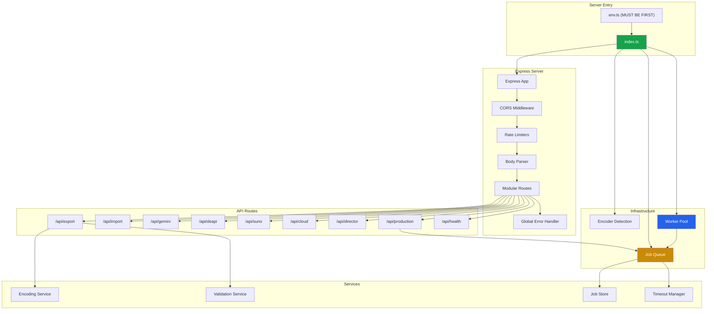

### Layer Responsibilities

| Layer | Responsibility | Location |
|-------|----------------|----------|
| **Entry** | Environment loading, server initialization | `env.ts`, `index.ts` |
| **Express** | HTTP server, middleware, routing | `index.ts` |
| **Routes** | API endpoint handlers | `routes/` |
| **Infrastructure** | Job queue, worker pool, encoder detection | `services/`, `workers/` |
| **Services** | Encoding, validation, job persistence | `services/` |
| **Shared** | Business logic, AI services (from shared package) | `@studio/shared` |

---

## Server Initialization

### Initialization Flow

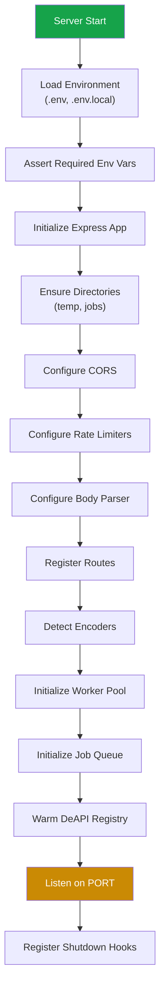

### Environment Loading

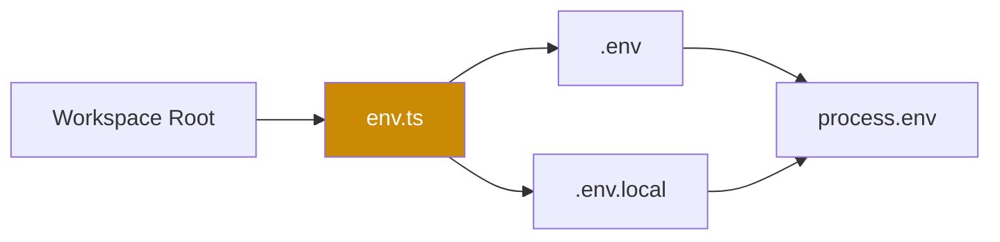

**Critical**: `env.ts` MUST be imported FIRST in `index.ts` before any other modules that use environment variables.

### Shutdown Flow

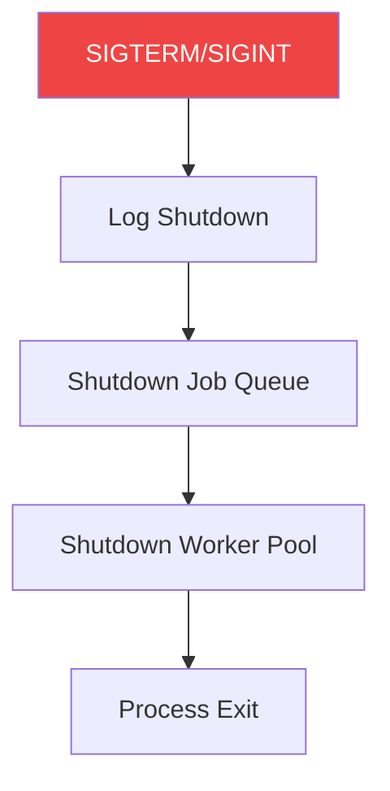

---

## Route Structure

### Route Configuration

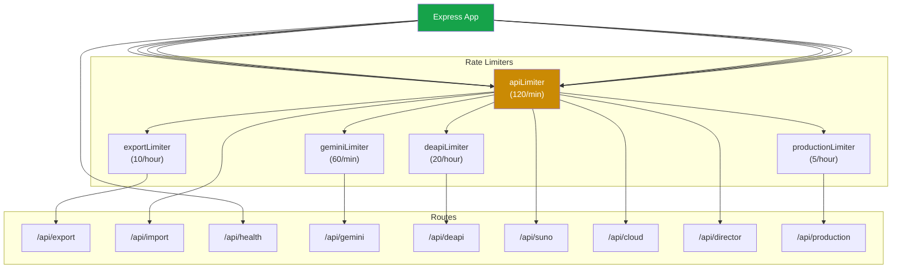

### Route Definitions

| Route | Rate Limit | Purpose | Handler |
|-------|------------|---------|---------|
| `/api/export` | 120/min, 10/hour | Video export | `routes/export.ts` |
| `/api/import` | 120/min | Project import | `routes/import.ts` |
| `/api/health` | None | Health check | `routes/health.ts` |
| `/api/gemini` | 120/min, 60/min | Gemini AI proxy | `routes/gemini.ts` |
| `/api/deapi` | 120/min, 20/hour | DeAPI model access | `routes/deapi.ts` |
| `/api/suno` | 120/min | Suno music generation | `routes/suno.ts` |
| `/api/cloud` | 120/min | Cloud services | `routes/cloud.ts` |
| `/api/director` | 120/min | Director agent | `routes/director.ts` |
| `/api/production` | 120/min, 5/hour | Video production | `routes/production.ts` |

### Route Middleware Stack

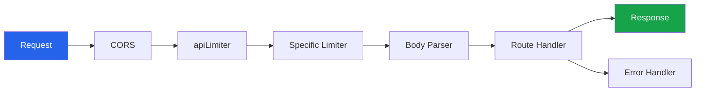

---

## Service Layer

### Service Architecture

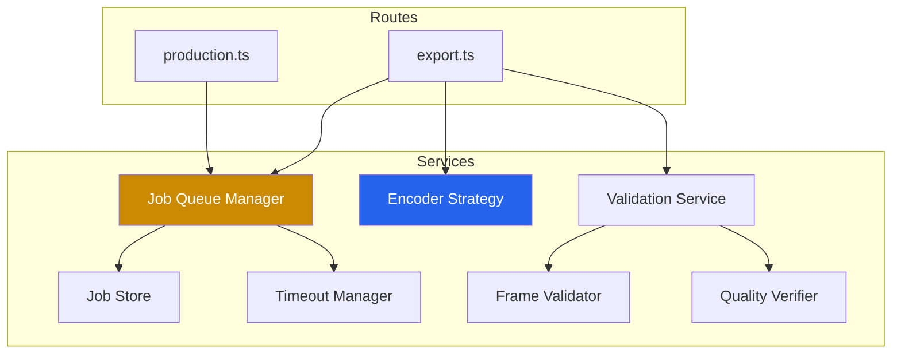

### Service Responsibilities

| Service | Responsibility | Used By |
|---------|----------------|---------|
| `JobQueueManager` | Job lifecycle, queue management, SSE subscriptions | export route, production route |
| `JobStore` | Job persistence to disk | JobQueueManager |
| `TimeoutManager` | Stall detection, timeout monitoring | JobQueueManager |
| `EncoderStrategy` | Encoder detection, selection, argument generation | export route |
| `FrameValidator` | Frame validation, size checking | export route |
| `QualityVerifier` | Output quality verification | export route |

---

## Worker Architecture

### Worker Pool Architecture

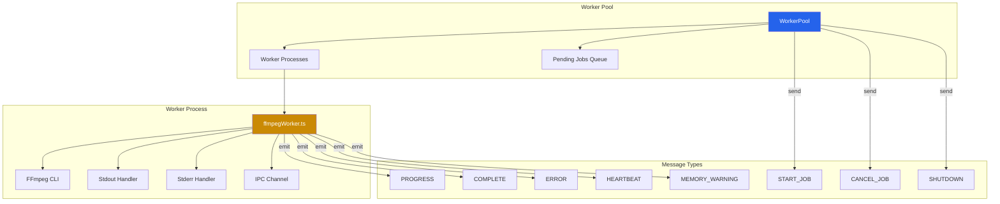

### Worker Lifecycle

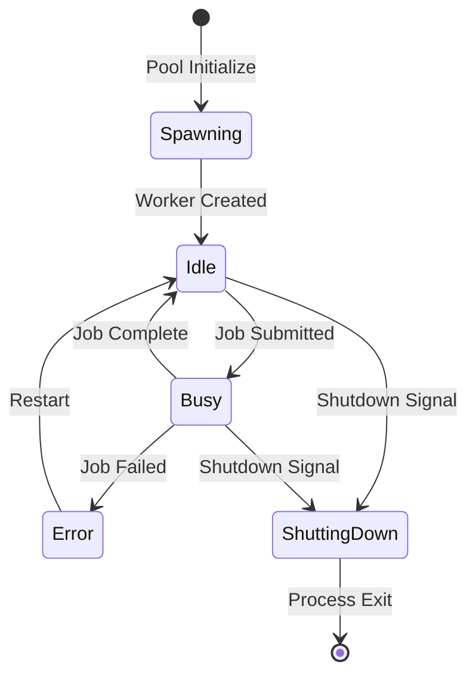

### Worker Configuration

| Configuration | Value | Description |
|--------------|-------|-------------|
| `MAX_WORKERS` | 4 | Maximum concurrent worker processes |
| `WORKER_MEMORY_LIMIT_MB` | 8192 | 8GB memory limit per worker |
| `WORKER_RESTART_DELAY_MS` | 1000 | Delay before restarting failed worker |

### Worker Message Flow

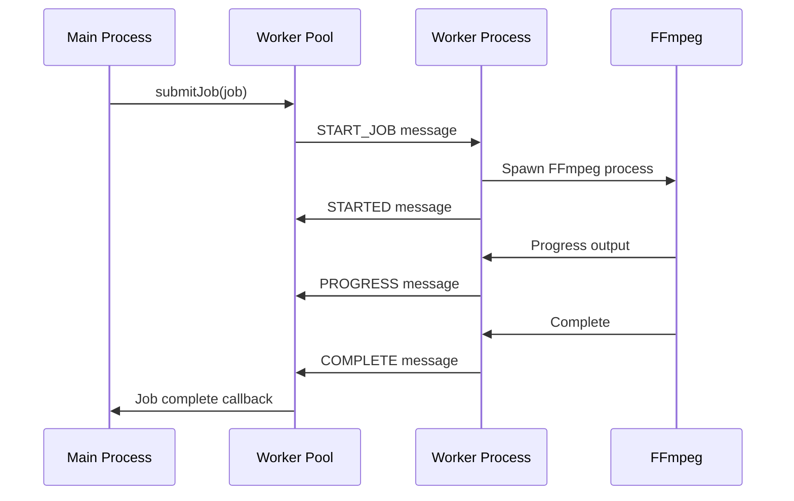

---

## Job Queue System

### Job Queue Architecture

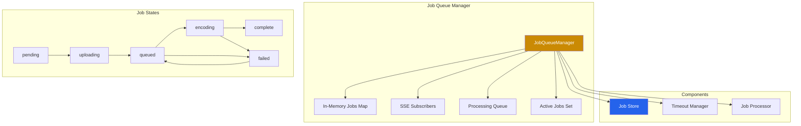

### Job Lifecycle

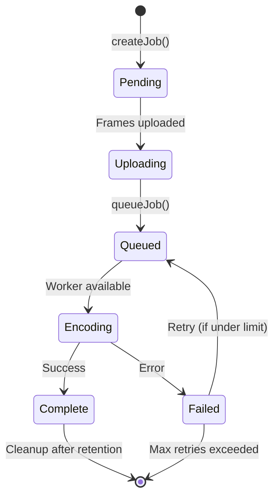

### Job Queue Flow

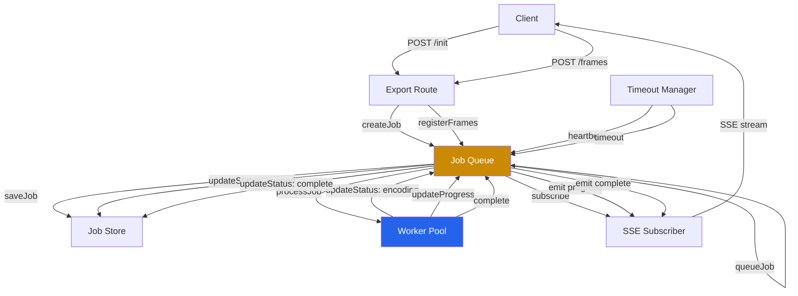

### Job Recovery

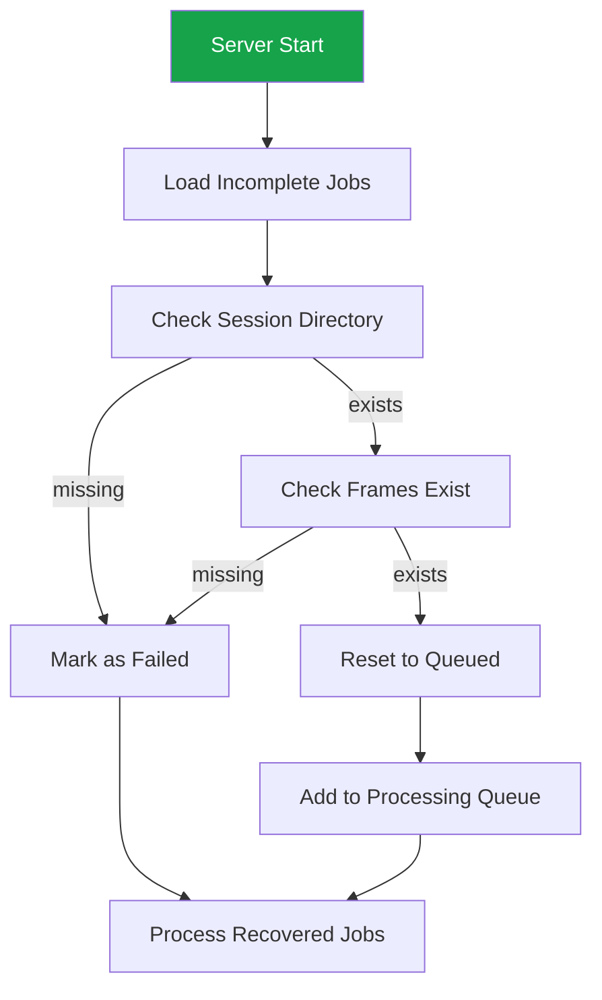

---

## Data Flow Patterns

### Pattern 1: Video Export Flow

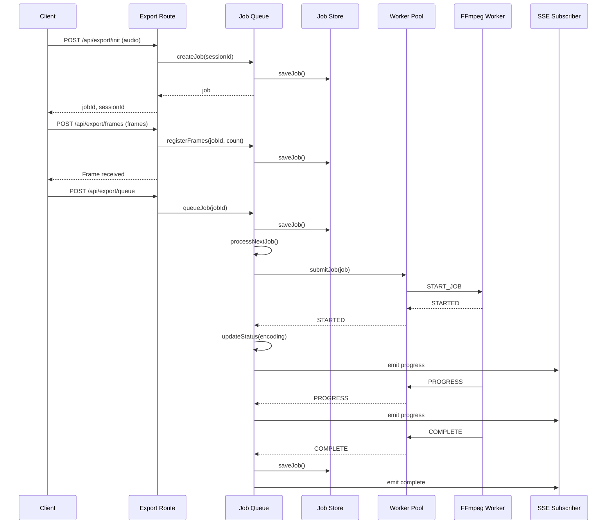

### Pattern 2: AI Generation Flow

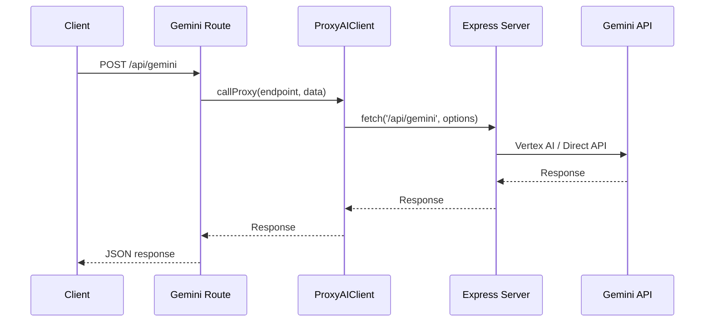

### Pattern 3: SSE Progress Streaming

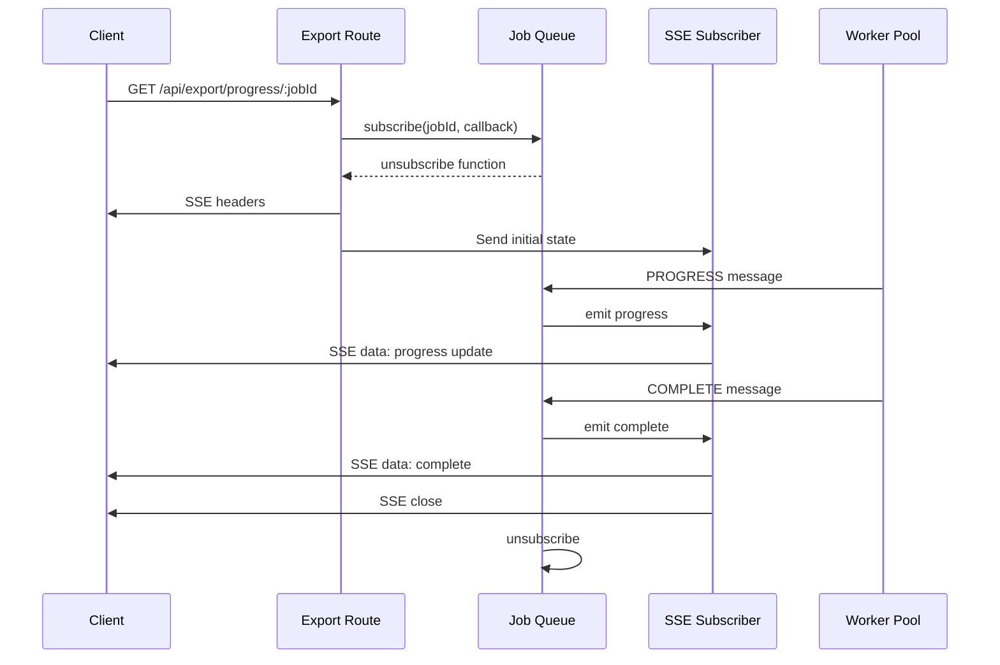

---

## API Endpoints

### Export Endpoints

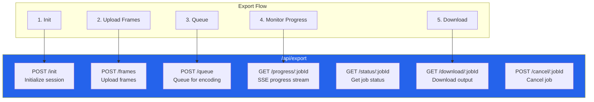

### Export Endpoint Details

| Endpoint | Method | Auth | Rate Limit | Purpose |
|----------|--------|------|------------|---------|
| `/api/export/init` | POST | Optional | 10/hour | Initialize export session |
| `/api/export/frames` | POST | Optional | 10/hour | Upload frame images |
| `/api/export/queue` | POST | Optional | 10/hour | Queue job for encoding |
| `/api/export/progress/:jobId` | GET | Optional | None | SSE progress stream |
| `/api/export/status/:jobId` | GET | Optional | None | Get job status |
| `/api/export/download/:jobId` | GET | Optional | None | Download output video |
| `/api/export/cancel/:jobId` | POST | Optional | None | Cancel job |

### AI Service Endpoints

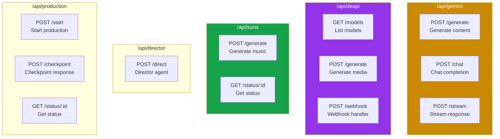

### AI Endpoint Details

| Route | Endpoint | Method | Rate Limit | Purpose |
|-------|----------|--------|------------|---------|
| `/api/gemini` | `/generate` | POST | 60/min | Generate content |
| `/api/gemini` | `/chat` | POST | 60/min | Chat completion |
| `/api/gemini` | `/stream` | POST | 60/min | Stream response |
| `/api/deapi` | `/models` | GET | 20/hour | List models |
| `/api/deapi` | `/generate` | POST | 20/hour | Generate media |
| `/api/deapi` | `/webhook` | POST | 20/hour | Webhook handler |
| `/api/suno` | `/generate` | POST | 120/min | Generate music |
| `/api/suno` | `/status/:id` | GET | 120/min | Get status |
| `/api/director` | `/direct` | POST | 120/min | Director agent |
| `/api/production` | `/start` | POST | 5/hour | Start production |
| `/api/production` | `/checkpoint` | POST | 5/hour | Checkpoint response |
| `/api/production` | `/status/:id` | GET | 5/hour | Get status |

---

## Service Relationships

### Export Route Dependencies

```mermaid
graph TD
    EXPORT["export.ts"]
    
    subgraph Dependencies["Dependencies"]
        UTILS["utils/index"]
        JOBQ["jobQueue"]
        ENCODER["encoderStrategy"]
        VALID["validation/frameValidator"]
        QUAL["validation/qualityVerifier"]
        TYPES["types/renderJob"]
        SHARED["@studio/shared"]
    end
    
    subgraph Utils["Utils Functions"]
        SANITIZE["sanitizeId"]
        SESSION["getSessionDir"]
        CLEANUP["cleanupSession"]
        GEN_ID["generateJobId"]
    end
    
    subgraph Encoding["Encoding Functions"]
        DETECT["detectEncoders"]
        SELECT["getSelectedEncoder"]
        INFO["getEncoderInfo"]
        ARGS["getEncoderArgs"]
    end
    
    subgraph Validation["Validation Functions"]
        VALID_SESSION["validateSessionFrames"]
        VALID_SIZES["validateFrameSizes"]
        VERIFY["verifyOutputQuality"]
        QUICK["quickValidate"]
    end
    
    EXPORT --> UTILS
    EXPORT --> JOBQ
    EXPORT --> ENCODER
    EXPORT --> VALID
    EXPORT --> TYPES
    EXPORT --> SHARED
    
    UTILS --> SANITIZE
    UTILS --> SESSION
    UTILS --> CLEANUP
    UTILS --> GEN_ID
    
    ENCODER --> DETECT
    ENCODER --> SELECT
    ENCODER --> INFO
    ENCODER --> ARGS
    
    VALID --> VALID_SESSION
    VALID --> VALID_SIZES
    VALID --> VERIFY
    VALID --> QUICK
    
    style EXPORT fill:#2563eb,color:#fff
    style JOBQ fill:#ca8a04,color:#fff
```

### Job Queue Dependencies

```mermaid
graph TD
    JOBQ["jobQueue/index"]
    
    subgraph Dependencies["Dependencies"]
        STORE["jobStore"]
        TIMEOUT["timeoutManager"]
        UTILS["utils/index"]
        TYPES["types/renderJob"]
        SHARED["@studio/shared"]
    end
    
    subgraph StoreFunctions["Job Store Functions"]
        SAVE["saveJob"]
        LOAD["loadJob"]
        DELETE["deleteJob"]
        LOAD_INC["loadIncompleteJobs"]
        CLEANUP["cleanupOldJobs"]
    end
    
    subgraph TimeoutFunctions["Timeout Functions"]
        START["start"]
        STOP["stop"]
        TRACK["trackJob"]
        UNTRACK["untrackJob"]
        RECORD["recordHeartbeat"]
    end
    
    JOBQ --> STORE
    JOBQ --> TIMEOUT
    JOBQ --> UTILS
    JOBQ --> TYPES
    JOBQ --> SHARED
    
    STORE --> SAVE
    STORE --> LOAD
    STORE --> DELETE
    STORE --> LOAD_INC
    STORE --> CLEANUP
    
    TIMEOUT --> START
    TIMEOUT --> STOP
    TIMEOUT --> TRACK
    TIMEOUT --> UNTRACK
    TIMEOUT --> RECORD
    
    style JOBQ fill:#ca8a04,color:#fff
    style STORE fill:#2563eb,color:#fff
```

### Worker Pool Dependencies

```mermaid
graph TD
    POOL["workerPool"]
    
    subgraph Dependencies["Dependencies"]
        TYPES["types/renderJob"]
        SHARED["@studio/shared"]
    end
    
    subgraph Worker["Worker Process"]
        FFMPEG["ffmpegWorker"]
        FLUENT["fluent-ffmpeg"]
        FS["fs"]
        PATH["path"]
    end
    
    POOL --> TYPES
    POOL --> SHARED
    POOL --> FFMPEG
    
    FFMPEG --> FLUENT
    FFMPEG --> FS
    FFMPEG --> PATH
    
    style POOL fill:#2563eb,color:#fff
    style FFMPEG fill:#ca8a04,color:#fff
```

---

## File Structure

### Server Package Structure

```
packages/server/
├── env.ts                          # Environment loader (MUST BE FIRST)
├── index.ts                        # Server entry point
├── types.ts                        # Server-specific types
├── package.json                    # Dependencies
├── tsconfig.json                   # TypeScript config
│
├── routes/                         # API route handlers
│   ├── export.ts                   # Video export endpoints
│   ├── import.ts                   # Project import endpoints
│   ├── health.ts                   # Health check
│   ├── gemini.ts                   # Gemini AI proxy
│   ├── deapi.ts                    # DeAPI integration
│   ├── suno.ts                     # Suno music generation
│   ├── cloud.ts                    # Cloud services
│   ├── director.ts                 # Director agent
│   ├── production.ts               # Video production
│   └── routeUtils.ts               # Route utilities
│
├── services/                       # Server services
│   ├── encoding/                   # Encoding strategy
│   │   └── encoderStrategy.ts
│   ├── jobQueue/                   # Job queue management
│   │   ├── index.ts                # Job queue manager
│   │   ├── jobStore.ts             # Job persistence
│   │   └── timeoutManager.ts       # Timeout monitoring
│   └── validation/                 # Validation services
│       ├── frameValidator.ts       # Frame validation
│       └── qualityVerifier.ts      # Quality verification
│
├── workers/                        # Worker processes
│   ├── workerPool.ts               # Worker pool manager
│   └── ffmpegWorker.ts            # FFmpeg worker
│
├── middleware/                     # Express middleware
│   └── auth.ts                     # Authentication middleware
│
├── utils/                          # Utility functions
│   ├── index.ts                    # Main utilities
│   └── response.ts                 # Response utilities
│
└── types/                          # Type definitions
    └── renderJob.ts                # Render job types
```

---

## Key Patterns

### Pattern 1: Rate Limiting Strategy

```mermaid
graph TD
    REQ["Request"]
    API["apiLimiter (120/min)"]
    SPECIFIC["Specific Limiter"]
    ROUTE["Route Handler"]
    
    REQ --> API
    API -->|"pass"| SPECIFIC
    API -->|"block"| ERR["Rate Limit Error"]
    SPECIFIC -->|"pass"| ROUTE
    SPECIFIC -->|"block"| ERR2["Specific Limit Error"]
    
    style API fill:#ca8a04,color:#fff
    style SPECIFIC fill:#2563eb,color:#fff
```

**Purpose**: Protect API from abuse with tiered rate limiting.

### Pattern 2: Job Queue with Workers

```mermaid
graph TD
    QUEUE["Job Queue"]
    PROC["Processing Queue"]
    ACTIVE["Active Jobs"]
    POOL["Worker Pool"]
    WORKER["Worker Process"]
    
    QUEUE -->|"queueJob"| PROC
    PROC -->|"processNextJob"| ACTIVE
    ACTIVE -->|"submitJob"| POOL
    POOL -->|"assign"| WORKER
    WORKER -->|"complete"| POOL
    POOL -->|"next"| ACTIVE
    
    style QUEUE fill:#ca8a04,color:#fff
    style POOL fill:#2563eb,color:#fff
```

**Purpose**: Manage concurrent video encoding with worker isolation.

### Pattern 3: SSE Progress Streaming

```mermaid
graph LR
    CLIENT["Client"]
    ROUTE["Route"]
    QUEUE["Job Queue"]
    SUB["Subscriber"]
    WORKER["Worker"]
    
    CLIENT -->|"GET /progress"| ROUTE
    ROUTE -->|"subscribe"| QUEUE
    QUEUE -->|"callback"| SUB
    SUB -->|"SSE"| CLIENT
    
    WORKER -->|"progress"| QUEUE
    QUEUE -->|"emit"| SUB
    SUB -->|"data"| CLIENT
    
    style QUEUE fill:#ca8a04,color:#fff
```

**Purpose**: Real-time progress updates without polling.

### Pattern 4: Job Persistence and Recovery

```mermaid
graph TD
    JOB["Job"]
    STORE["Job Store"]
    DISK["Disk (temp/jobs/)"]
    RESTART["Server Restart"]
    RECOVER["Recover Jobs"]
    QUEUE["Re-queue"]
    
    JOB -->|"save"| STORE
    STORE -->|"write"| DISK
    RESTART --> RECOVER
    RECOVER -->|"load"| STORE
    STORE -->|"read"| DISK
    RECOVER --> QUEUE
    
    style STORE fill:#2563eb,color:#fff
```

**Purpose**: Survive server restarts with job recovery.

---

## Performance Considerations

### Worker Pool Optimization

```mermaid
graph TD
    subgraph Pool["Worker Pool"]
        MAX["MAX_WORKERS = 4"]
        MEM["8GB per worker"]
        PRESPAWN["Pre-spawn 1 worker"]
        QUEUE["Pending job queue"]
    end
    
    subgraph Optimization["Optimizations"]
        ISOLATION["Process isolation"]
        MEM_LIMIT["Memory limits"]
        RESTART["Auto-restart on failure"]
        QUEUE_M["Job queuing"]
    end
    
    Pool --> Optimization
    
    style Pool fill:#16a34a,color:#fff
```

### Job Queue Optimization

```mermaid
graph TD
    subgraph Queue["Job Queue"]
        MAX_CONCURRENT["MAX_CONCURRENT_JOBS = 4"]
        RETENTION["30 min retention"]
        CLEANUP["Hourly cleanup"]
        TIMEOUT["60s stall, 30min timeout"]
    end
    
    subgraph Optimization["Optimizations"]
        IN_MEMORY["In-memory job map"]
        PERSIST["Selective persistence"]
        SUBSCRIBE["SSE subscribers"]
        RECOVERY["Job recovery"]
    end
    
    Queue --> Optimization
    
    style Queue fill:#ca8a04,color:#fff
```

### Rate Limiting Strategy

```mermaid
graph LR
    API["API Limiter<br/>120/min"]
    GEMINI["Gemini Limiter<br/>60/min"]
    PROD["Production Limiter<br/>5/hour"]
    EXPORT["Export Limiter<br/>10/hour"]
    DEAPI["DeAPI Limiter<br/>20/hour"]
    
    style API fill:#ca8a04,color:#fff
    style PROD fill:#ef4444,color:#fff
```

---

## Security Considerations

### Security Architecture

```mermaid
graph TD
    subgraph Security["Security Layers"]
        CORS["CORS Policy"]
        RATE["Rate Limiting"]
        AUTH["Auth Middleware"]
        VALID["Input Validation"]
        SANITIZE["ID Sanitization"]
    end
    
    subgraph Data["Data Protection"]
        ENV["Environment Variables"]
        SECRET["API Secrets"]
        TEMP["Temp File Cleanup"]
    end
    
    subgraph Network["Network Security"]
        ORIGINS["Allowed Origins"]
        LOCAL["Localhost Only"]
        PROD["Production Origins"]
    end
    
    Security --> Data
    Security --> Network
    
    style CORS fill:#16a34a,color:#fff
    style AUTH fill:#ca8a04,color:#fff
```

### Security Measures

1. **CORS**: Configurable allowed origins
2. **Rate Limiting**: Tiered rate limiting per route
3. **Authentication**: Optional auth middleware
4. **Input Validation**: Frame validation, size limits
5. **Sanitization**: Session ID sanitization
6. **Secrets**: Environment variable protection
7. **Cleanup**: Automatic temp file cleanup

---

## Error Handling

### Error Handling Strategy

```mermaid
graph TD
    ERROR["Error"]
    CATCH["Try-Catch Block"]
    LOG["Logger"]
    RES["Response"]
    QUEUE["Job Queue"]
    RETRY["Retry Logic"]
    
    ERROR --> CATCH
    CATCH --> LOG
    CATCH --> RES
    CATCH --> QUEUE
    QUEUE --> RETRY
    
    style ERROR fill:#ef4444,color:#fff
```

### Error Types

| Error Type | Handling | Retry |
|------------|----------|-------|
| Validation Error | Return 400 with details | No |
| Rate Limit Error | Return 429 with retry-after | No |
| Worker Error | Mark job failed, retry if under limit | Yes |
| Timeout Error | Mark job failed, retry if under limit | Yes |
| API Error | Return 500 with error message | No |
| File System Error | Log error, return 500 | No |

---

## Monitoring and Observability

### Logging Architecture

```mermaid
graph TD
    subgraph Logging["Logging"]
        LOGGER["createLogger"]
        CONSOLE["Console Output"]
        FILE["File Output (optional)"]
    end
    
    subgraph Loggers["Loggers"]
        SERVER["Server"]
        EXPORT["Export"]
        FFmpeg["FFmpeg"]
        WORKER["Worker"]
        JOBQ["Job Queue"]
    end
    
    LOGGER --> CONSOLE
    LOGGER --> FILE
    SERVER --> LOGGER
    EXPORT --> LOGGER
    FFmpeg --> LOGGER
    WORKER --> LOGGER
    JOBQ --> LOGGER
    
    style LOGGER fill:#ca8a04,color:#fff
```

### Metrics Available

- **Job Queue Stats**: Total, pending, uploading, queued, encoding, complete, failed
- **Worker Pool Stats**: Total workers, active workers, idle workers, pending jobs, unhealthy workers
- **Job Progress**: Progress percentage, current frame, total frames
- **Timing**: Started at, completed at, duration

---

## Maintenance Guidelines

### Adding New Routes

1. Create route file in `routes/`
2. Add route to `index.ts` with appropriate rate limiter
3. Add route to `routes.ts` config (if needed)
4. Add authentication if required
5. Add error handling
6. Add logging
7. Update this document

### Adding New Services

1. Create service file in `services/`
2. Follow existing service patterns
3. Add TypeScript types
4. Add error handling
5. Add logging
6. Add tests
7. Update service relationships diagram

### Modifying Worker Behavior

1. Update `ffmpegWorker.ts` for worker logic
2. Update `workerPool.ts` for pool management
3. Update message types in `types/renderJob.ts`
4. Test worker lifecycle
5. Test error handling
6. Update worker architecture diagram

### Modifying Job Queue

1. Update `jobQueue/index.ts` for queue logic
2. Update `jobStore.ts` for persistence
3. Update `timeoutManager.ts` for timeout logic
4. Test job recovery
5. Test SSE subscriptions
6. Update job queue diagram

---

## Resources

### Documentation

- **Frontend Diagram Source of Truth**: `docs/FRONTEND_DIAGRAM_SOURCE_OF_TRUTH.md`
- **Visual Source of Truth**: `docs/VISUAL_SOURCE_OF_TRUTH.md`
- **Architecture**: `docs/ARCHITECTURE.md`
- **AGENTS.md**: Project-wide agents documentation

### External Documentation

- **Express**: https://expressjs.com
- **Multer**: https://github.com/expressjs/multer
- **fluent-ffmpeg**: https://github.com/fluent-ffmpeg/node-fluent-ffmpeg
- **FFmpeg**: https://ffmpeg.org

---

## Changelog

### Version 1.0 (April 2026)
- Initial Server Diagram Source of Truth documentation
- Complete architecture overview
- Server initialization flow
- Route structure with rate limiting
- Service layer documentation
- Worker architecture with message flow
- Job queue system with lifecycle
- Data flow patterns (export, AI, SSE)
- API endpoints documentation
- Service relationships
- File structure
- Key patterns
- Performance considerations
- Security considerations
- Error handling strategy
- Monitoring and observability
- Maintenance guidelines

---

**This document is the single source of truth for all server architecture diagrams and structural relationships in AI Soul Studio. All architectural changes should be documented here first.**
