# Shared Package Diagram Source of Truth

**Version**: 1.0  
**Last Updated**: April 2026  
**Package**: `@studio/shared`

---

## Overview

This document is the single source of truth for all shared package architecture diagrams, type systems, service relationships, and data flow patterns in AI Soul Studio. The shared package contains all business logic, types, stores, and services used by both frontend and server.

## Table of Contents

1. [Architecture Overview](#architecture-overview)
2. [Type System](#type-system)
3. [State Management](#state-management)
4. [Service Layer Organization](#service-layer-organization)
5. [AI Services](#ai-services)
6. [Pipeline System](#pipeline-system)
7. [Media Services](#media-services)
8. [Agent Tools](#agent-tools)
9. [Prompt System](#prompt-system)
10. [FFmpeg Services](#ffmpeg-services)
11. [Data Flow Patterns](#data-flow-patterns)
12. [File Structure](#file-structure)

---

## Architecture Overview

### High-Level Architecture

```mermaid
graph TB
    subgraph Shared["@studio/shared"]
        TYPES["Types"]
        STORES["Stores"]
        SERVICES["Services"]
        CONSTANTS["Constants"]
        UTILS["Utils"]
        LIB["Lib"]
    end
    
    subgraph Types["Types Module"]
        MEDIA["media.ts"]
        SCENE["scene.ts"]
        STORY["story.ts"]
        PIPELINE["pipeline.ts"]
        ASSISTANT["assistant.ts"]
        AUDIO["audio.ts"]
        LAYOUT["layout.ts"]
        ASSEMBLY["assembly.ts"]
    end
    
    subgraph Stores["Stores Module"]
        APP_STORE["appStore"]
        SLICES["Slices"]
    end
    
    subgraph Services["Services Module"]
        AI["ai/"]
        AGENT["agent/"]
        FFmpeg["ffmpeg/"]
        MEDIA_SVC["media/"]
        PIPELINES["pipelines/"]
        PROMPT["prompt/"]
        INFRA["infrastructure/"]
        CONTENT["content/"]
        AUDIO_PROC["audio-processing/"]
        CLOUD["cloud/"]
        MUSIC["music/"]
        ORCHESTRATION["orchestration/"]
        PROJECT["project/"]
        TTS["tts/"]
        SHARED_SVC["shared/"]
        UTILS_SVC["utils/"]
        TRACING["tracing/"]
        FORMAT["format/"]
    end
    
    Shared --> TYPES
    Shared --> STORES
    Shared --> SERVICES
    Shared --> CONSTANTS
    Shared --> UTILS
    Shared --> LIB
    
    TYPES --> MEDIA
    TYPES --> SCENE
    TYPES --> STORY
    TYPES --> PIPELINE
    TYPES --> ASSISTANT
    TYPES --> AUDIO
    TYPES --> LAYOUT
    TYPES --> ASSEMBLY
    
    STORES --> APP_STORE
    APP_STORE --> SLICES
    
    SERVICES --> AI
    SERVICES --> AGENT
    SERVICES --> FFmpeg
    SERVICES --> MEDIA_SVC
    SERVICES --> PIPELINES
    SERVICES --> PROMPT
    SERVICES --> INFRA
    SERVICES --> CONTENT
    SERVICES --> AUDIO_PROC
    SERVICES --> CLOUD
    SERVICES --> MUSIC
    SERVICES --> ORCHESTRATION
    SERVICES --> PROJECT
    SERVICES --> TTS
    SERVICES --> SHARED_SVC
    SERVICES --> UTILS_SVC
    SERVICES --> TRACING
    SERVICES --> FORMAT
    
    style TYPES fill:#ca8a04,color:#fff
    style STORES fill:#2563eb,color:#fff
    style SERVICES fill:#16a34a,color:#fff
```

### Layer Responsibilities

| Layer | Responsibility | Location |
|-------|----------------|----------|
| **Types** | Domain types, interfaces, type definitions | `src/types/` |
| **Stores** | Zustand state management | `src/stores/` |
| **Services** | Business logic, AI services, media processing | `src/services/` |
| **Constants** | Application constants | `src/constants/` |
| **Utils** | Utility functions | `src/utils/` |
| **Lib** | Library functions | `src/lib/` |

---

## Type System

### Type Architecture

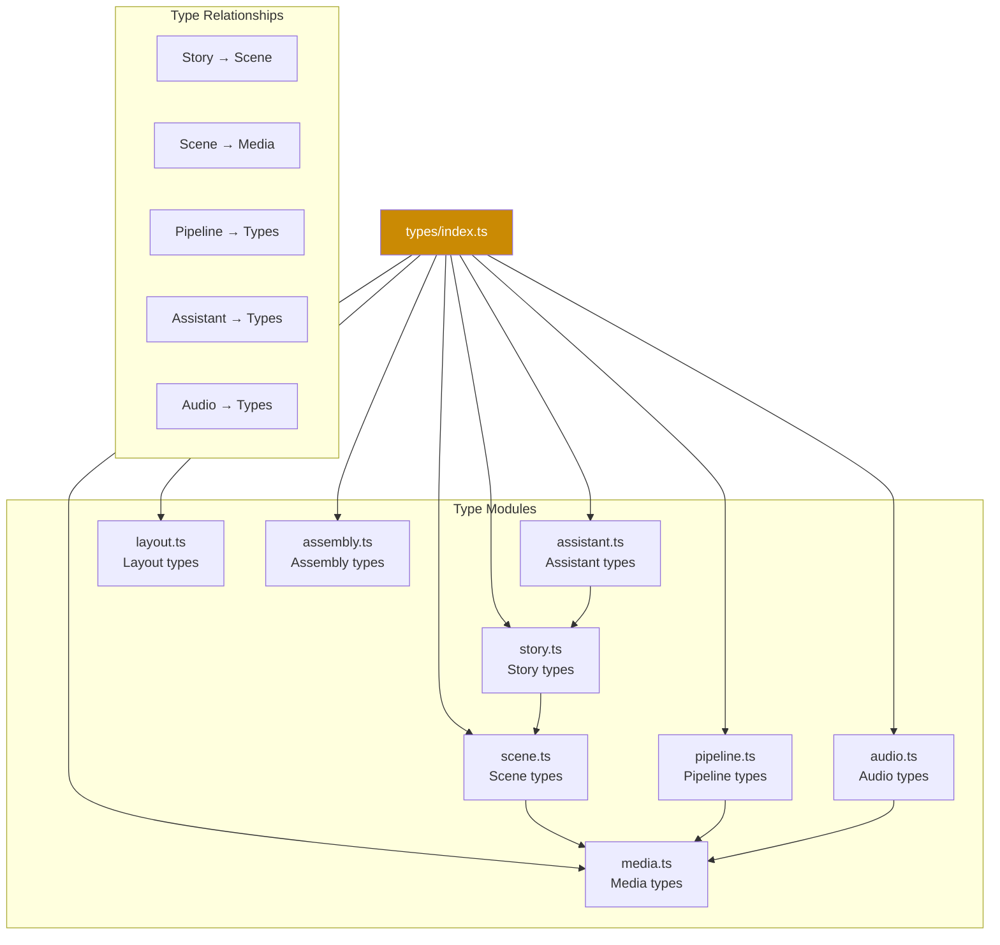

### Type Module Details

| Module | Purpose | Key Types |
|--------|---------|-----------|
| `media.ts` | Media assets, images, videos | `MediaAsset`, `ImageAsset`, `VideoAsset` |
| `scene.ts` | Scene composition, shots | `Scene`, `Shot`, `CameraAngle` |
| `story.ts` | Story structure, narrative | `Story`, `StoryBeat`, `NarrativeArc` |
| `pipeline.ts` | Pipeline configuration | `PipelineConfig`, `PipelineStage` |
| `assistant.ts` | AI assistant types | `AssistantMessage`, `AssistantContext` |
| `audio.ts` | Audio types | `AudioTrack`, `AudioMetadata` |
| `layout.ts` | Layout types | `LayoutConfig`, `Spacing` |
| `assembly.ts` | Assembly types | `AssemblyConfig`, `ComponentAssembly` |

---

## State Management

### Store Architecture

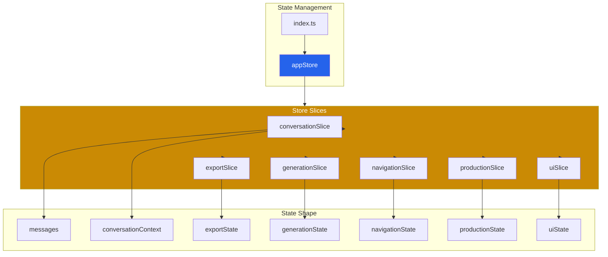

### Store Slice Responsibilities

| Slice | State | Purpose | Used By |
|-------|-------|---------|---------|
| `conversationSlice` | messages, conversationContext | Chat/conversation state | StudioScreen, VideoProductionPanel |
| `exportSlice` | exportState | Export configuration and state | Export routes |
| `generationSlice` | generationState | AI generation state | StoryWorkspace, VideoProductionPanel |
| `navigationSlice` | navigationState | Navigation state | StudioScreen |
| `productionSlice` | productionState | Production pipeline state | VideoProductionPanel |
| `uiSlice` | uiState | UI preferences, modals | StudioScreen, VideoEditor |

---

## Service Layer Organization

### Service Architecture

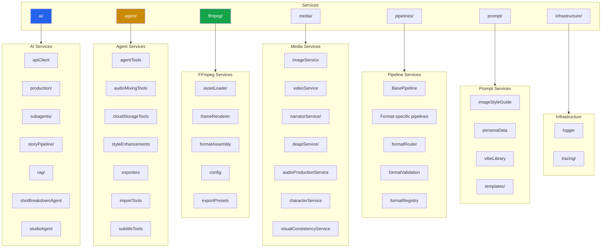

### Service Category Responsibilities

| Category | Purpose | Key Services |
|----------|---------|--------------|
| **ai/** | AI integration, Gemini API, production orchestration | apiClient, production, subagents |
| **agent/** | Agent tools, tool registry, error recovery | agentTools, exportTools, importTools |
| **ffmpeg/** | FFmpeg operations, video export, rendering | frameRenderer, exporters, formatAssembly |
| **media/** | Media generation, image/video/audio services | imageService, videoService, narratorService |
| **pipelines/** | Format-specific production pipelines | BasePipeline, formatRouter, formatValidation |
| **prompt/** | Prompt templates, style guides, persona data | imageStyleGuide, vibeLibrary, templates |
| **infrastructure/** | Logging, tracing, configuration | logger, tracing |
| **content/** | Content processing, generation | content services |
| **audio-processing/** | Audio processing, mixing | audio services |
| **cloud/** | Cloud storage, operations | cloudStorageTools |
| **music/** | Music generation, Suno integration | music services |
| **orchestration/** | Workflow orchestration | orchestration services |
| **project/** | Project management | project services |
| **tts/** | Text-to-speech | TTS services |
| **shared/** | Shared utilities | shared services |
| **utils/** | Utility functions | utility services |
| **tracing/** | Distributed tracing | tracing services |
| **format/** | Format handling | format services |

---

## AI Services

### AI Service Architecture

```mermaid
graph TD
    subgraph AI["AI Services"]
        API["apiClient"]
        CONFIG["config"]
        PROD["production/"]
        SUBAGENTS["subagents/"]
        STORY["storyPipeline/"]
        RAG["rag/"]
        SHOT["shotBreakdownAgent"]
        STUDIO["studioAgent"]
    end
    
    subgraph Production["Production Orchestration"]
        CORE["agentCore"]
        ORCHESTRATOR["orchestratorTypes"]
        PARALLEL["parallelExecutionEngine"]
        PERSISTENCE["persistence"]
        API_PROD["productionApi"]
        PROMPTS["prompts"]
        CACHE["resultCache"]
        STORE["store"]
        TOOLS["tools/"]
        ERROR["errorHandler"]
        UTILS["utils"]
        TYPES["types"]
    end
    
    subgraph Subagents["Subagents"]
        CONTENT["contentSubagent"]
        ENHANCE["enhancementExportSubagent"]
        IMPORT["importSubagent"]
        MEDIA["mediaSubagent"]
        SUPERVISOR["supervisorAgent"]
    end
    
    subgraph StoryPipeline["Story Pipeline"]
        PIPELINE["storyPipeline"]
        TOOLS_S["tools/"]
    end
    
    subgraph RAG["RAG"]
        RESEARCH["researchService"]
        GROUNDING["grounding"]
    end
    
    AI --> API
    AI --> CONFIG
    AI --> PROD
    AI --> SUBAGENTS
    AI --> STORY
    AI --> RAG
    AI --> SHOT
    AI --> STUDIO
    
    PROD --> CORE
    PROD --> ORCHESTRATOR
    PROD --> PARALLEL
    PROD --> PERSISTENCE
    PROD --> API_PROD
    PROD --> PROMPTS
    PROD --> CACHE
    PROD --> STORE
    PROD --> TOOLS
    PROD --> ERROR
    PROD --> UTILS
    PROD --> TYPES
    
    SUBAGENTS --> CONTENT
    SUBAGENTS --> ENHANCE
    SUBAGENTS --> IMPORT
    SUBAGENTS --> MEDIA
    SUBAGENTS --> SUPERVISOR
    
    STORY --> PIPELINE
    STORY --> TOOLS_S
    
    RAG --> RESEARCH
    RAG --> GROUNDING
    
    style API fill:#ca8a04,color:#fff
    style PROD fill:#2563eb,color:#fff
    style SUBAGENTS fill:#16a34a,color:#fff
```

### AI Client Configuration

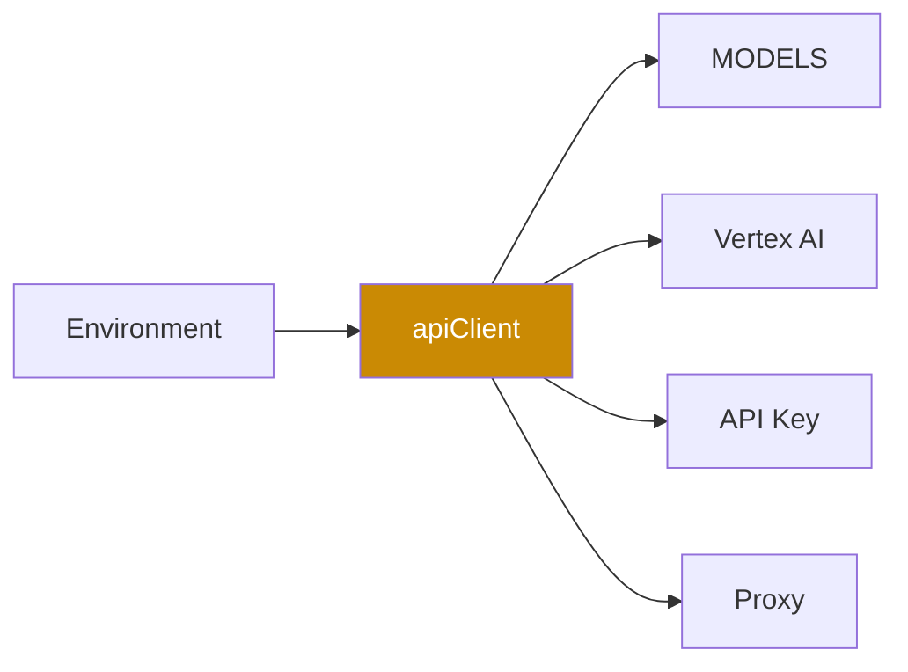

### Model Configuration

| Model Type | Model Name | Purpose |
|------------|-----------|---------|
| `TEXT` | `gemini-3-flash-preview` | Text generation |
| `IMAGE` | `imagen-4.0-fast-generate-001` | Image generation |
| `VIDEO` | `veo-3.1-fast-generate-preview` | Video generation |
| `TTS` | `gemini-2.5-flash-preview-tts` | Text-to-speech |
| `TEXT_GROUNDED` | `gemini-3-flash-preview` | Grounded text generation |
| `TEXT_EXP` | `gemini-3.1-pro-preview` | Advanced reasoning |

---

## Pipeline System

### Pipeline Architecture

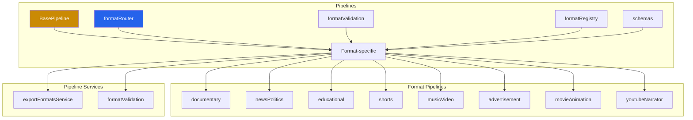

### Pipeline Flow

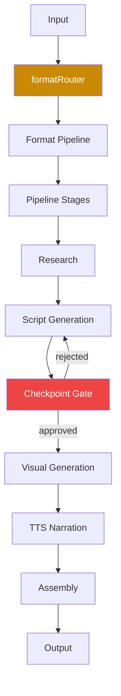

### Pipeline Stages

| Stage | Purpose | Service |
|-------|---------|---------|
| Research | Gather information, grounded research | researchService |
| Script Generation | Generate script/narrative | gemini API |
| Checkpoint Gate | User approval step | checkpointSystem |
| Visual Generation | Generate images/video | imageService, videoService |
| Narration | Generate TTS narration | narratorService |
| Assembly | Assemble final output | FFmpeg services |

---

## Media Services

### Media Service Architecture

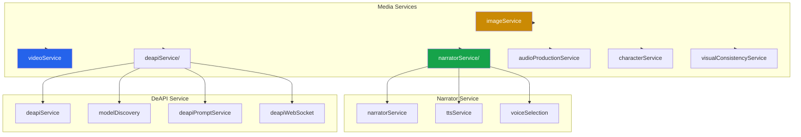

### Media Service Responsibilities

| Service | Purpose | Used By |
|---------|---------|---------|
| `imageService` | Image generation via Gemini Imagen | Pipelines, production |
| `videoService` | Video operations, processing | Pipelines, production |
| `narratorService` | TTS narration generation | Pipelines, production |
| `deapiService` | DeAPI model integration | Video production |
| `audioProductionService` | Audio production, mixing | Music pipeline |
| `characterService` | Character generation, consistency | Story pipeline |
| `visualConsistencyService` | Visual consistency across shots | Pipelines |

---

## Agent Tools

### Agent Tool Architecture

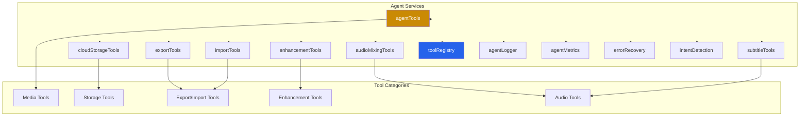

### Tool Categories

| Category | Tools | Purpose |
|----------|-------|---------|
| **Media Tools** | Image generation, video processing | Generate and process media |
| **Storage Tools** | Cloud storage operations | Store/retrieve assets |
| **Export/Import Tools** | Project export/import | Move projects in/out |
| **Enhancement Tools** | Quality enhancement | Improve output quality |
| **Audio Tools** | Audio mixing, subtitles | Audio processing |

---

## Prompt System

### Prompt Architecture

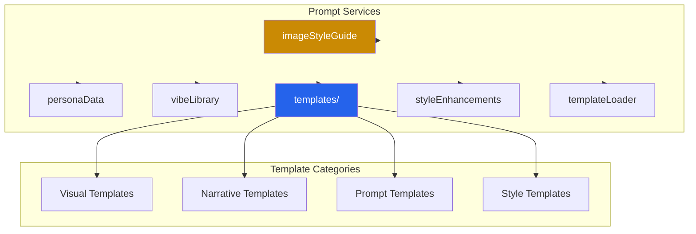

### Prompt System Responsibilities

| Service | Purpose | Used By |
|---------|---------|---------|
| `imageStyleGuide` | Image generation style guidelines | imageService |
| `personaData` | Persona definitions for generation | AI services |
| `vibeLibrary` | Vibe/mood templates | Prompt generation |
| `templates/` | Prompt templates by category | All AI services |
| `styleEnhancements` | Style enhancement prompts | Enhancement tools |
| `templateLoader` | Template loading/management | Prompt system |

---

## FFmpeg Services

### FFmpeg Service Architecture

```mermaid
graph TD
    subgraph FFmpeg["FFmpeg Services"]
        ASSET["assetLoader"]
        RENDER["frameRenderer"]
        EXPORT["exporters"]
        ASSEMBLY["formatAssembly"]
        CONFIG["exportConfig"]
        PRESETS["exportPresets"]
        UPLOAD["exportUpload"]
        PERSISTENCE["exportPersistence"]
        PIPELINE["renderPipeline"]
        TEXT["textRenderer"]
        TRANSITIONS["transitions"]
        AUDIO_PREP["audioPreparation"]
        EXTRACTOR["videoAudioExtractor"]
        CHECKSUM["checksumGenerator"]
        ENV["envUtils"]
        QUALITY["formatQuality"]
        VISUALIZER["visualizer"]
        SSE["sseClient"]
    end
    
    subgraph ExportFlow["Export Flow"]
        LOAD["Load Assets"]
        RENDER_FRAMES["Render Frames"]
        ASSEMBLE_VIDEO["Assemble Video"]
        UPLOAD_OUTPUT["Upload Output"]
        QUALITY_CHECK["Quality Check"]
    end
    
    FFmpeg --> ASSET
    FFmpeg --> RENDER
    FFmpeg --> EXPORT
    FFmpeg --> ASSEMBLY
    FFmpeg --> CONFIG
    FFmpeg --> PRESETS
    FFmpeg --> UPLOAD
    FFmpeg --> PERSISTENCE
    FFmpeg --> PIPELINE
    FFmpeg --> TEXT
    FFmpeg --> TRANSITIONS
    FFmpeg --> AUDIO_PREP
    FFmpeg --> EXTRACTOR
    FFmpeg --> CHECKSUM
    FFmpeg --> ENV
    FFmpeg --> QUALITY
    FFmpeg --> VISUALIZER
    FFmpeg --> SSE
    
    ASSET --> LOAD
    RENDER --> RENDER_FRAMES
    ASSEMBLY --> ASSEMBLE_VIDEO
    UPLOAD --> UPLOAD_OUTPUT
    QUALITY --> QUALITY_CHECK
    
    style RENDER fill:#ca8a04,color:#fff
    style ASSEMBLY fill:#2563eb,color:#fff
```

### FFmpeg Service Responsibilities

| Service | Purpose | Used By |
|---------|---------|---------|
| `assetLoader` | Load media assets | Export pipeline |
| `frameRenderer` | Render individual frames | Export pipeline |
| `exporters` | Video export operations | Export routes |
| `formatAssembly` | Assemble video from frames | Export pipeline |
| `exportConfig` | Export configuration | All export operations |
| `exportPresets` | Quality/format presets | Export configuration |
| `exportUpload` | Upload output to storage | Export pipeline |
| `exportPersistence` | Persist export state | Export pipeline |
| `renderPipeline` | Orchestrate rendering | Export pipeline |
| `textRenderer` | Render text overlays | Export pipeline |
| `transitions` | Video transitions | Export pipeline |
| `audioPreparation` | Prepare audio for export | Export pipeline |
| `videoAudioExtractor` | Extract audio from video | Import pipeline |
| `checksumGenerator` | Generate frame checksums | Export pipeline |
| `formatQuality` | Quality verification | Export pipeline |
| `visualizer` | Audio visualization | Visualizer screen |
| `sseClient` | SSE client for progress | Export monitoring |

---

## Data Flow Patterns

### Pattern 1: AI Generation Flow

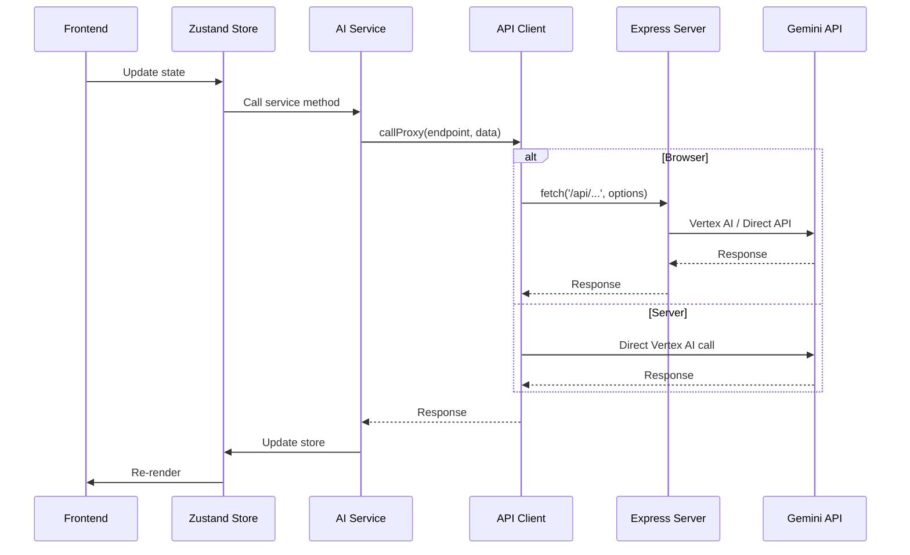

### Pattern 2: Pipeline Execution Flow

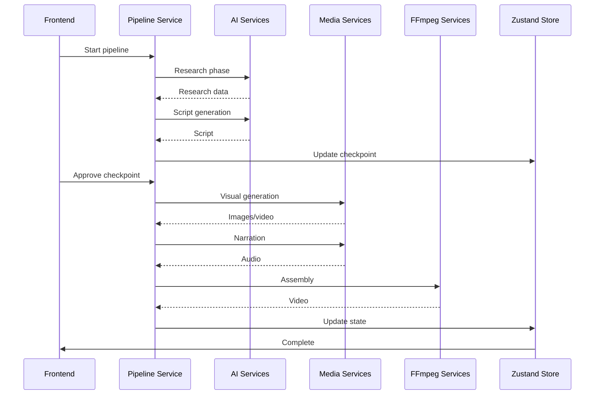

### Pattern 3: Export Flow

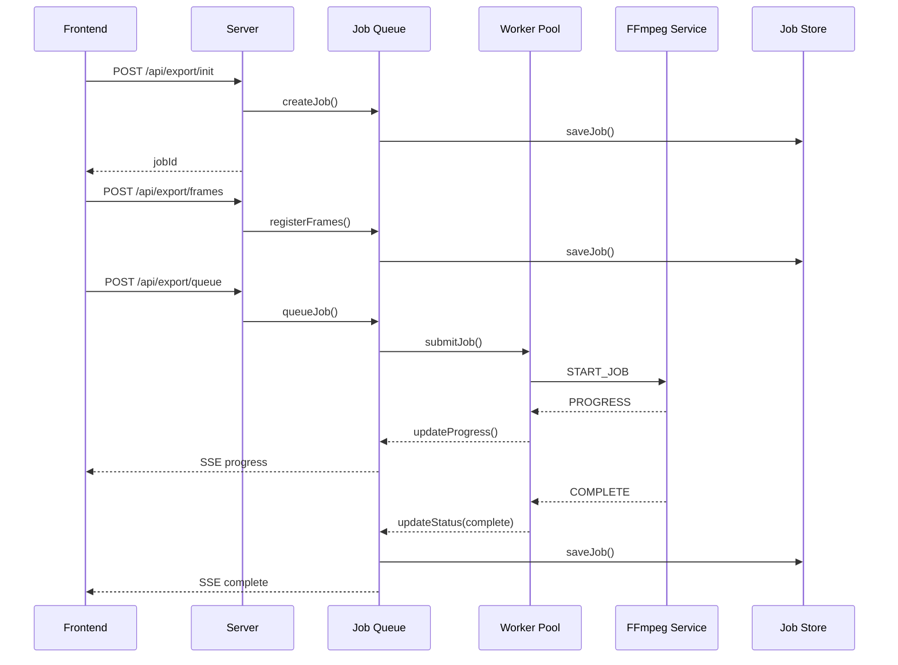

---

## File Structure

### Shared Package Structure

```
packages/shared/
├── src/
│   ├── types/                      # Type definitions
│   │   ├── media.ts               # Media types
│   │   ├── scene.ts               # Scene types
│   │   ├── story.ts               # Story types
│   │   ├── pipeline.ts            # Pipeline types
│   │   ├── assistant.ts           # Assistant types
│   │   ├── audio.ts               # Audio types
│   │   ├── layout.ts              # Layout types
│   │   ├── assembly.ts            # Assembly types
│   │   └── index.ts               # Type barrel export
│   │
│   ├── stores/                     # Zustand stores
│   │   ├── appStore.ts            # Main app store
│   │   ├── slices/                # Store slices
│   │   │   ├── conversationSlice.ts
│   │   │   ├── exportSlice.ts
│   │   │   ├── generationSlice.ts
│   │   │   ├── navigationSlice.ts
│   │   │   ├── productionSlice.ts
│   │   │   └── uiSlice.ts
│   │   ├── prompt.md              # Store documentation
│   │   └── index.ts               # Store barrel export
│   │
│   ├── services/                   # Business logic services
│   │   ├── ai/                    # AI services
│   │   │   ├── apiClient.ts       # Gemini API client
│   │   │   ├── config.ts          # AI configuration
│   │   │   ├── production/        # Production orchestration
│   │   │   ├── subagents/         # AI subagents
│   │   │   ├── storyPipeline/     # Story pipeline
│   │   │   ├── rag/               # RAG services
│   │   │   ├── shotBreakdownAgent.ts
│   │   │   └── studioAgent.ts
│   │   │
│   │   ├── agent/                 # Agent tools
│   │   │   ├── agentTools.ts
│   │   │   ├── audioMixingTools.ts
│   │   │   ├── cloudStorageTools.ts
│   │   │   ├── enhancementTools.ts
│   │   │   ├── exportTools.ts
│   │   │   ├── importTools.ts
│   │   │   ├── subtitleTools.ts
│   │   │   ├── toolRegistry.ts
│   │   │   ├── agentLogger.ts
│   │   │   ├── agentMetrics.ts
│   │   │   ├── errorRecovery.ts
│   │   │   ├── intentDetection.ts
│   │   │   └── schemas/
│   │   │
│   │   ├── ffmpeg/                # FFmpeg services
│   │   │   ├── assetLoader.ts
│   │   │   ├── frameRenderer.ts
│   │   │   ├── exporters.ts
│   │   │   ├── formatAssembly.ts
│   │   │   ├── exportConfig.ts
│   │   │   ├── exportPresets.ts
│   │   │   ├── exportUpload.ts
│   │   │   ├── exportPersistence.ts
│   │   │   ├── renderPipeline.ts
│   │   │   ├── textRenderer.ts
│   │   │   ├── transitions.ts
│   │   │   ├── audioPreparation.ts
│   │   │   ├── videoAudioExtractor.ts
│   │   │   ├── checksumGenerator.ts
│   │   │   ├── envUtils.ts
│   │   │   ├── formatQuality.ts
│   │   │   ├── visualizer.ts
│   │   │   └── sseClient.ts
│   │   │
│   │   ├── media/                 # Media services
│   │   │   ├── imageService.ts
│   │   │   ├── videoService.ts
│   │   │   ├── narratorService/
│   │   │   ├── deapiService/
│   │   │   ├── deapiPromptService.ts
│   │   │   ├── deapiWebSocket.ts
│   │   │   ├── audioProductionService.ts
│   │   │   ├── characterService.ts
│   │   │   └── visualConsistencyService.ts
│   │   │
│   │   ├── pipelines/              # Production pipelines
│   │   │   ├── BasePipeline.ts
│   │   │   ├── documentary.ts
│   │   │   ├── newsPolitics.ts
│   │   │   ├── educational.ts
│   │   │   ├── shorts.ts
│   │   │   ├── musicVideo.ts
│   │   │   ├── advertisement.ts
│   │   │   ├── movieAnimation.ts
│   │   │   ├── youtubeNarrator.ts
│   │   │   ├── exportFormatsService.ts
│   │   │   ├── formatRouter.ts
│   │   │   ├── formatValidation.ts
│   │   │   ├── formatRegistry.ts
│   │   │   └── schemas.ts
│   │   │
│   │   ├── prompt/                # Prompt system
│   │   │   ├── imageStyleGuide.ts
│   │   │   ├── personaData.ts
│   │   │   ├── vibeLibrary.ts
│   │   │   ├── templates/
│   │   │   ├── styleEnhancements.ts
│   │   │   └── templateLoader.ts
│   │   │
│   │   ├── infrastructure/        # Infrastructure
│   │   │   ├── logger.ts
│   │   │   ├── tracing/
│   │   │   └── config.ts
│   │   │
│   │   ├── content/               # Content services
│   │   ├── audio-processing/       # Audio processing
│   │   ├── cloud/                 # Cloud services
│   │   ├── music/                 # Music services
│   │   ├── orchestration/         # Orchestration
│   │   ├── project/               # Project services
│   │   ├── tts/                   # TTS services
│   │   ├── shared/                # Shared utilities
│   │   ├── utils/                 # Service utilities
│   │   ├── tracing/               # Tracing
│   │   └── format/                # Format services
│   │
│   ├── constants/                  # Constants
│   ├── lib/                        # Library functions
│   ├── utils/                      # Utilities
│   ├── types.ts                    # Root types
│   └── vite-env.d.ts              # Vite types
│
├── package.json                    # Dependencies
└── tsconfig.json                   # TypeScript config
```

---

## Key Patterns

### Pattern 1: API Client Proxy Pattern

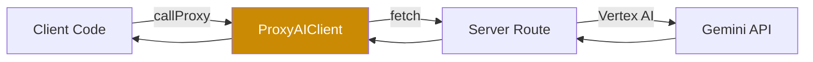

**Purpose**: Isomorphic AI API calls work in both browser (via proxy) and server (direct).

### Pattern 2: Pipeline Checkpoint Pattern

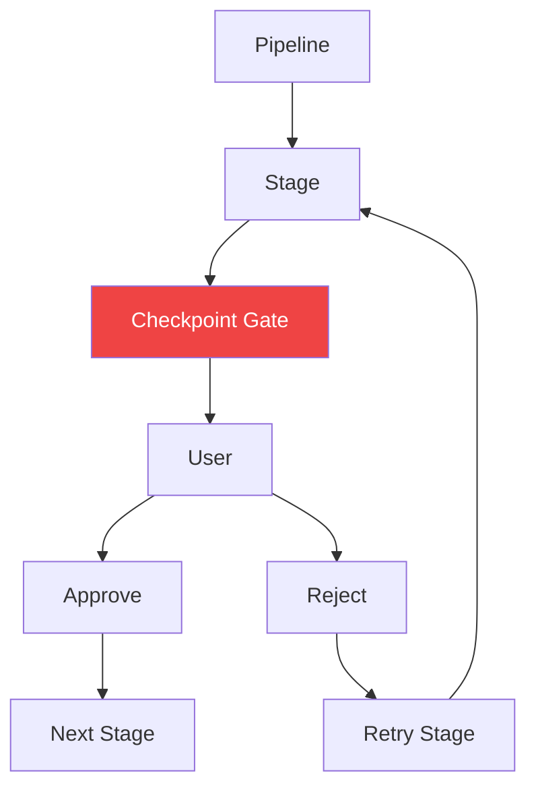

**Purpose**: User approval gates at critical pipeline stages.

### Pattern 3: Store Slice Pattern

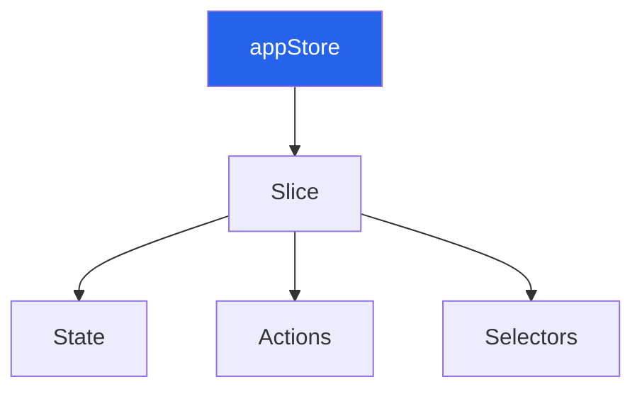

**Purpose**: Modular state management with focused slices.

### Pattern 4: Service Composition Pattern

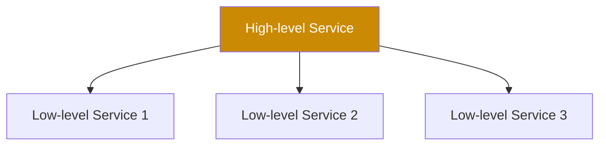

**Purpose**: Compose complex operations from simpler services.

---

## Maintenance Guidelines

### Adding New Types

1. Add type file to `src/types/`
2. Export from `src/types/index.ts`
3. Add JSDoc comments
4. Add tests
5. Update type architecture diagram

### Adding New Store Slices

1. Add slice file to `src/stores/slices/`
2. Integrate into `appStore.ts`
3. Add actions and selectors
4. Add tests
5. Update store architecture diagram

### Adding New Services

1. Add service file to appropriate `src/services/` subdirectory
2. Follow existing service patterns
3. Add TypeScript types
4. Add error handling
5. Add logging
6. Add tests
7. Update service architecture diagram

### Adding New Pipelines

1. Add pipeline file to `src/services/pipelines/`
2. Extend `BasePipeline`
3. Implement required stages
4. Add to format registry
5. Add validation
6. Add tests
7. Update pipeline architecture diagram

---

## Resources

### Documentation

- **Frontend Diagram Source of Truth**: `docs/FRONTEND_DIAGRAM_SOURCE_OF_TRUTH.md`
- **Server Diagram Source of Truth**: `docs/SERVER_DIAGRAM_SOURCE_OF_TRUTH.md`
- **Visual Source of Truth**: `docs/VISUAL_SOURCE_OF_TRUTH.md`
- **Architecture**: `docs/ARCHITECTURE.md`
- **AGENTS.md**: Project-wide agents documentation

### External Documentation

- **Zustand**: https://zustand-demo.pmnd.rs
- **Gemini API**: https://ai.google.dev/gemini-api
- **FFmpeg**: https://ffmpeg.org
- **fluent-ffmpeg**: https://github.com/fluent-ffmpeg/node-fluent-ffmpeg

---

## Changelog

### Version 1.0 (April 2026)
- Initial Shared Package Diagram Source of Truth documentation
- Complete architecture overview
- Type system documentation
- State management architecture
- Service layer organization
- AI services architecture
- Pipeline system documentation
- Media services architecture
- Agent tools architecture
- Prompt system documentation
- FFmpeg services architecture
- Data flow patterns (AI, pipeline, export)
- File structure
- Key patterns
- Maintenance guidelines

---

**This document is the single source of truth for all shared package architecture diagrams and structural relationships in AI Soul Studio. All architectural changes should be documented here first.**
