# API Call Diagram — AI Soul Studio

Generated: 2026-04-09

## Full API Flow (Mermaid)

```mermaid
flowchart TD
    %% ─── FRONTEND CALLERS ───────────────────────────────────────────
    subgraph FE ["packages/frontend"]
        FE_QU["QuickUpload.tsx\n(import-export/)"]
        FE_HOOKS["useDeApiModels.ts\n(hooks/)"]
        FE_PROD["productionApi.ts\n(shared→services/ai/production/)"]
        FE_PROXY["ProxyAIClient\n(shared→services/shared/apiClient.ts)"]
        FE_DEAPI["deapiService/\n(shared→services/media/)"]
    end

    %% ─── EXPRESS SERVER ──────────────────────────────────────────────
    subgraph SRV ["packages/server"]
        SRV_IDX["index.ts\n(route mounting + rate limits)"]

        subgraph ROUTES ["routes/"]
            R_HEALTH["health.ts\n→ GET /api/health"]
            R_GEMINI["gemini.ts\n→ POST /api/gemini/proxy/generateContent\n→ POST /api/gemini/proxy/generateImages"]
            R_DEAPI["deapi.ts\n→ POST /api/deapi/img2video\n→ POST /api/deapi/txt2video\n→ POST /api/deapi/img2img\n→ POST /api/deapi/img-rmbg\n→ POST /api/deapi/animate\n→ POST /api/deapi/batch\n→ POST /api/deapi/ws-auth\n→ POST /api/deapi/webhook\n→ POST /api/deapi/prompt/:type\n→ GET  /api/deapi/models\n→ ANY  /api/deapi/proxy/*"]
            R_SUNO["suno.ts\n→ POST /api/suno/upload\n→ ANY  /api/suno/proxy/*"]
            R_CLOUD["cloud.ts\n→ POST /api/cloud/init\n→ POST /api/cloud/upload-asset\n→ GET  /api/cloud/status\n→ GET  /api/cloud/file"]
            R_EXPORT["export.ts\n→ POST /api/export/init\n→ PUT  /api/export/frames\n→ POST /api/export/cancel/:jobId\n→ GET  /api/export/status/:jobId"]
            R_IMPORT["import.ts\n→ POST /api/import/youtube"]
            R_DIR["director.ts\n→ POST /api/director/generate"]
            R_PROD["production.ts\n→ POST /api/production/start\n→ GET  /api/production/stream/:runId\n→ GET  /api/production/snapshot/:sessionId"]
        end

        subgraph SRV_SVC ["server services"]
            SRV_JQ["jobQueue.ts"]
            SRV_WP["workerPool.ts"]
            SRV_FW["ffmpegWorker.ts"]
            SRV_ENC["encoderStrategy.ts"]
        end
    end

    %% ─── SHARED SERVICES ─────────────────────────────────────────────
    subgraph SH ["packages/shared"]
        SH_API["apiClient.ts\n(services/shared/)"]
        SH_PROD_CORE["agentCore.ts\n(services/ai/production/)"]
        SH_PROD_API["productionApi.ts\n(services/ai/production/)"]
        SH_DIR_SVC["generatePromptsWithLangChain\n(services/ai/director/)"]
        SH_DEAPI_SVC["deapiService/\nimageGeneration.ts\nvideoGeneration.ts"]
    end

    %% ─── EXTERNAL SERVICES ───────────────────────────────────────────
    subgraph EXT ["External Services"]
        EXT_GEMINI["Google Gemini / Vertex AI\n(GOOGLE_CLOUD_PROJECT\nor VITE_GEMINI_API_KEY)"]
        EXT_DEAPI["DeAPI\napi.deapi.ai\n(VITE_DEAPI_API_KEY)"]
        EXT_SUNO["Suno\napi.sunoapi.org\n(VITE_SUNO_API_KEY)"]
        EXT_GCS["Google Cloud Storage\ngs://bucket\n(GOOGLE_CLOUD_PROJECT)"]
        EXT_YTDLP["yt-dlp CLI\n(local binary)"]
        EXT_PUSHER["Pusher WebSocket\n(via DeAPI ws-auth)"]
    end

    %% ─── CONNECTIONS ─────────────────────────────────────────────────

    %% Server index mounts routes
    SRV_IDX --> R_HEALTH
    SRV_IDX --> R_GEMINI
    SRV_IDX --> R_DEAPI
    SRV_IDX --> R_SUNO
    SRV_IDX --> R_CLOUD
    SRV_IDX --> R_EXPORT
    SRV_IDX --> R_IMPORT
    SRV_IDX --> R_DIR
    SRV_IDX --> R_PROD

    %% Frontend → Server
    FE_PROXY -->|"POST /api/gemini/proxy/*"| R_GEMINI
    FE_DEAPI -->|"POST /api/deapi/*"| R_DEAPI
    FE_HOOKS -->|"GET /api/deapi/models"| R_DEAPI
    FE_QU -->|"POST /api/import/youtube"| R_IMPORT
    FE_QU -->|"POST /api/suno/proxy/generate"| R_SUNO
    FE_PROD -->|"POST /api/production/start"| R_PROD
    FE_PROD -->|"GET /api/production/stream/:runId (SSE)"| R_PROD

    %% Server → External
    R_GEMINI -->|"ai.models.generateContent()\nai.models.generateImages()"| EXT_GEMINI
    R_DEAPI -->|"fetch api.deapi.ai\nBearer DEAPI_API_KEY"| EXT_DEAPI
    R_DEAPI -->|"ws-auth → broadcasting/auth"| EXT_PUSHER
    R_SUNO -->|"fetch api.sunoapi.org"| EXT_SUNO
    R_CLOUD -->|"GCS SDK"| EXT_GCS
    R_IMPORT -->|"spawn yt-dlp"| EXT_YTDLP

    %% Export internal
    R_EXPORT --> SRV_JQ
    SRV_JQ --> SRV_WP
    SRV_WP --> SRV_FW
    SRV_FW --> SRV_ENC

    %% Director
    R_DIR --> SH_DIR_SVC
    SH_DIR_SVC -->|"LangChain → Gemini"| EXT_GEMINI

    %% Production orchestration
    R_PROD --> SH_PROD_CORE
    SH_PROD_CORE --> R_GEMINI
    SH_PROD_CORE --> R_DEAPI
    SH_PROD_CORE --> R_SUNO
    SH_PROD_CORE --> R_CLOUD
    SH_PROD_CORE --> R_DIR
    SH_PROD_CORE --> R_EXPORT

    %% Shared client wiring
    FE_PROXY --> SH_API
    SH_API -->|"callProxy()"| R_GEMINI
```

---

## Endpoint Quick Reference

| Frontend File | Calls | Server Route File |
|---|---|---|
| `shared/services/shared/apiClient.ts` | `POST /api/gemini/proxy/generateContent` | `server/routes/gemini.ts` |
| `shared/services/shared/apiClient.ts` | `POST /api/gemini/proxy/generateImages` | `server/routes/gemini.ts` |
| `shared/services/media/deapiService/` | `POST /api/deapi/txt2video` | `server/routes/deapi.ts` |
| `shared/services/media/deapiService/` | `POST /api/deapi/img2video` | `server/routes/deapi.ts` |
| `shared/services/media/deapiService/` | `POST /api/deapi/img2img` | `server/routes/deapi.ts` |
| `shared/services/media/deapiService/` | `POST /api/deapi/img-rmbg` | `server/routes/deapi.ts` |
| `frontend/hooks/useDeApiModels.ts` | `GET /api/deapi/models` | `server/routes/deapi.ts` |
| `frontend/components/.../QuickUpload.tsx` | `POST /api/import/youtube` | `server/routes/import.ts` |
| `frontend/components/.../QuickUpload.tsx` | `POST /api/suno/proxy/generate` | `server/routes/suno.ts` |
| `shared/services/ai/production/productionApi.ts` | `POST /api/production/start` | `server/routes/production.ts` |
| `shared/services/ai/production/productionApi.ts` | `GET /api/production/stream/:runId` | `server/routes/production.ts` |
| `shared/services/ai/production/productionApi.ts` | `GET /api/production/snapshot/:sessionId` | `server/routes/production.ts` |
| `server/routes/export.ts` | `POST /api/export/init` | `server/routes/export.ts` |
| `server/routes/export.ts` | `PUT /api/export/frames` | `server/routes/export.ts` |
| `server/routes/export.ts` | `GET /api/export/status/:jobId` | `server/routes/export.ts` |

## Server → External Service Map

| Server Route File | External Service | Auth |
|---|---|---|
| `server/routes/gemini.ts` | Google Gemini (Vertex AI SDK) | `GOOGLE_CLOUD_PROJECT` or `VITE_GEMINI_API_KEY` |
| `server/routes/deapi.ts` | `api.deapi.ai` | `VITE_DEAPI_API_KEY` (Bearer) |
| `server/routes/deapi.ts` | Pusher (ws-auth via DeAPI) | via DeAPI HMAC |
| `server/routes/suno.ts` | `api.sunoapi.org` | `VITE_SUNO_API_KEY` (Bearer) |
| `server/routes/cloud.ts` | Google Cloud Storage | `GOOGLE_CLOUD_PROJECT` (ADC) |
| `server/routes/import.ts` | yt-dlp (local CLI) | none |
| `server/routes/director.ts` → shared | Google Gemini via LangChain | same as gemini |
| `server/routes/production.ts` → shared | All of the above (orchestrated) | all of the above |

## Rate Limits (packages/server/index.ts)

| Route Group | Limit |
|---|---|
| Generic API | 120 req / 1 min |
| `/api/gemini` | 60 req / 1 min |
| `/api/production/start` | 5 POST / 1 hour |
| `/api/export` (POST/PUT) | 10 req / 1 hour |
| `/api/deapi` (write) | 20 req / 1 hour |
