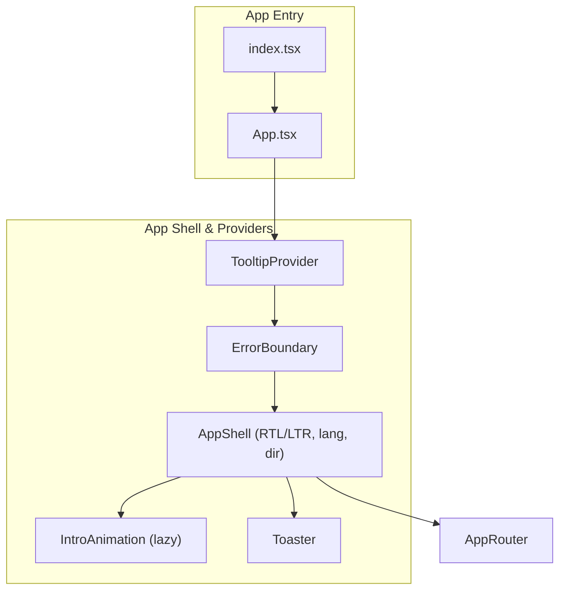
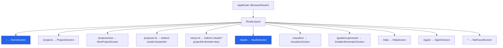
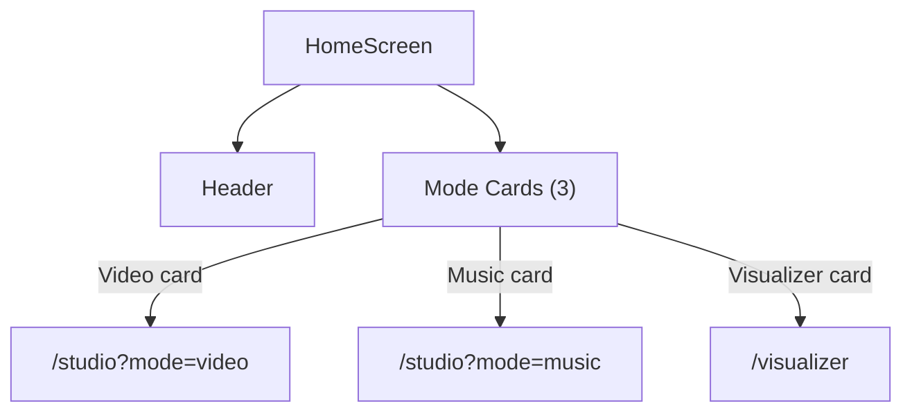
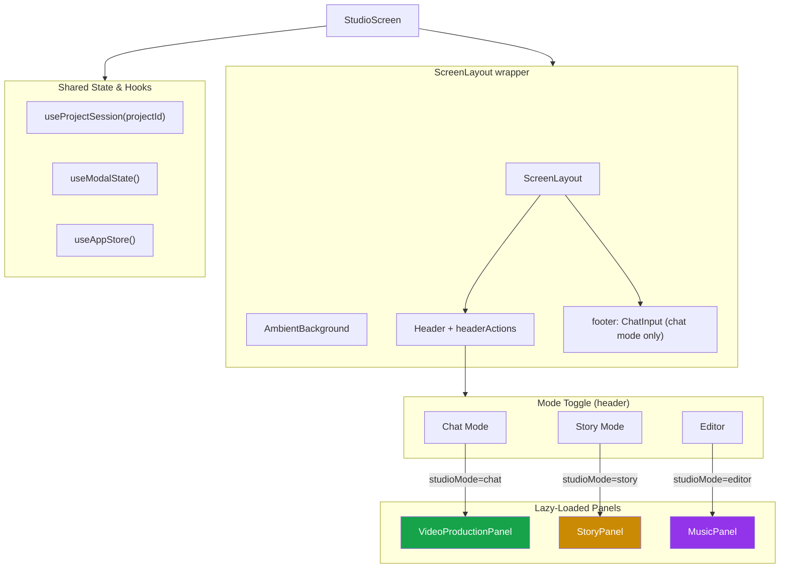
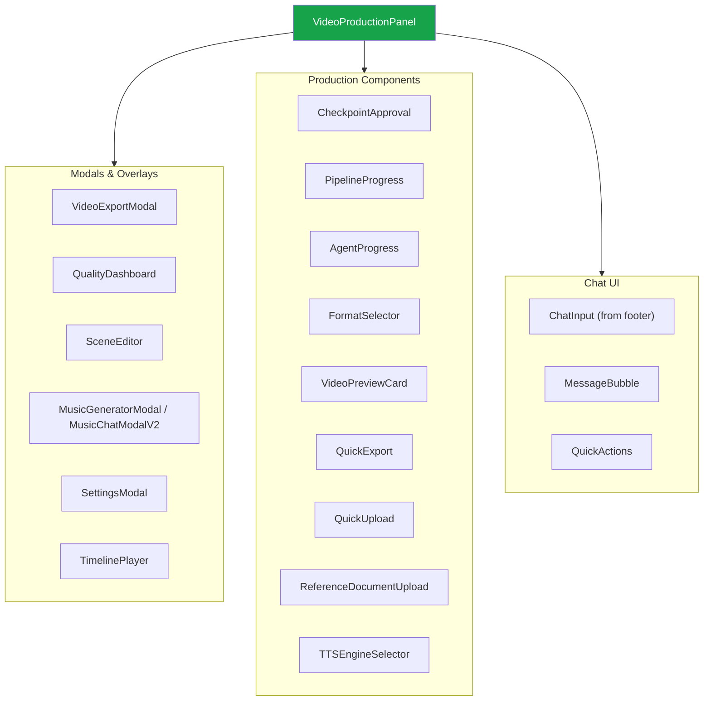
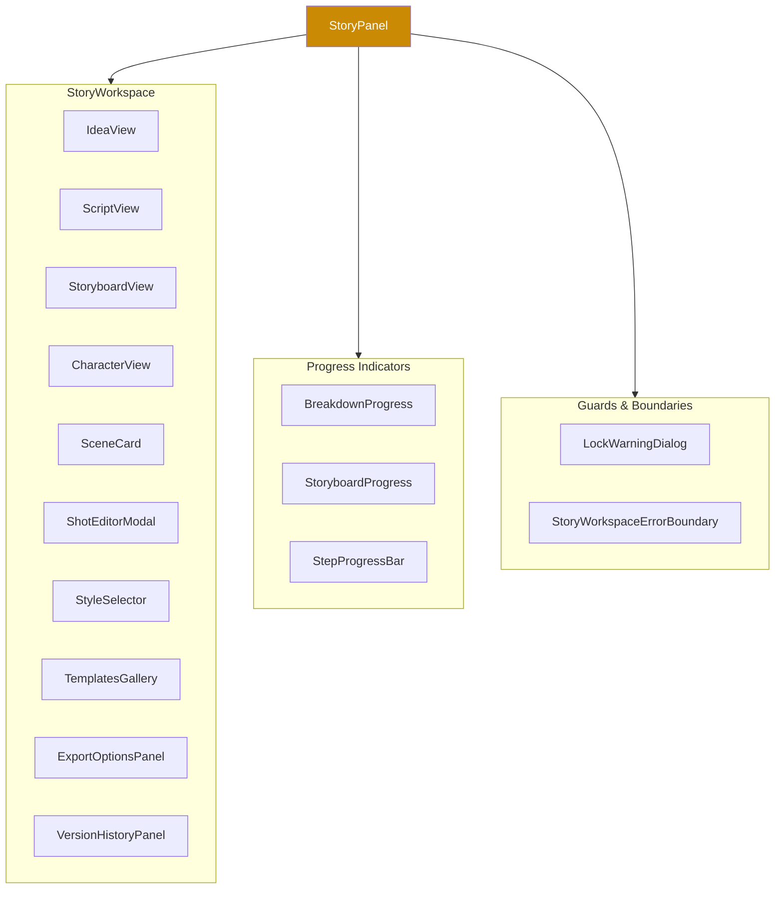
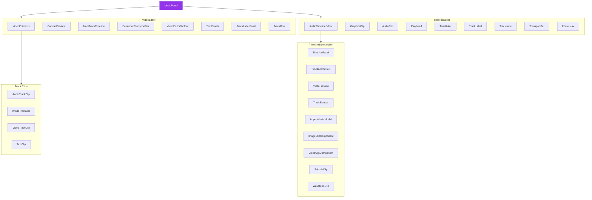
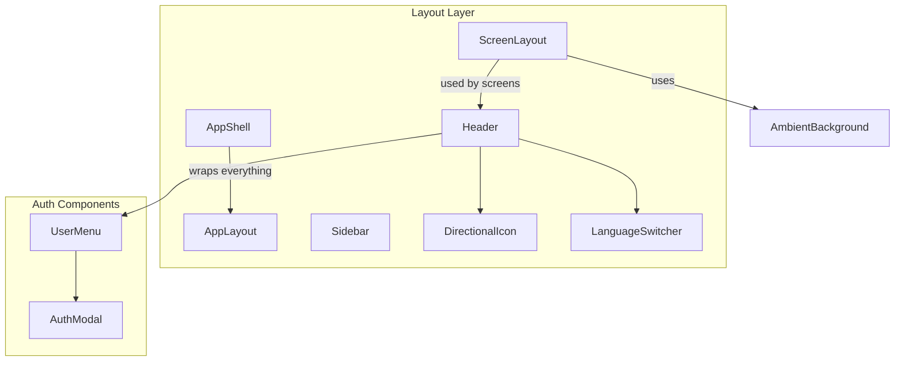
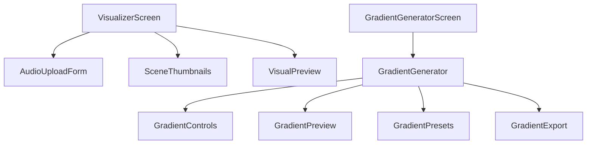
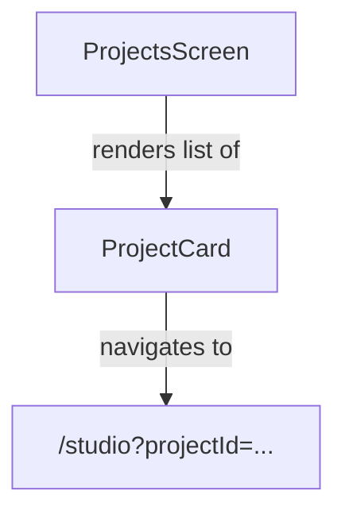

# Frontend Component Wiring Diagram

## App Entry & Shell



## Router → Screens



## HomeScreen Internals



## StudioScreen — The Main Hub



## VideoProductionPanel — Chat/Video Mode



## StoryPanel — Story Mode



## MusicPanel — Editor Mode



## Layout Components (shared across screens)



## Visualizer & Gradient Screens



## Projects Screen



## Data Flow Summary

```
┌─────────────────────────────────────────────────────────────┐
│                        App.tsx                              │
│  TooltipProvider → ErrorBoundary → AppShell → AppRouter     │
└──────────────────────────┬──────────────────────────────────┘
                           │
              ┌────────────┼────────────────┐
              │            │                │
         HomeScreen    StudioScreen    Other Screens
              │            │           (Visualizer,
              │            │            Projects,
         Header +     ScreenLayout      Gradient,
         Mode Cards    ├── Header        Help, etc.)
              │        ├── [Mode Toggle]
              │        ├── Content Area
              │        │    ├── VideoProductionPanel (chat)
              │        │    ├── StoryPanel (story)
              │        │    └── MusicPanel (editor)
              │        └── Footer (ChatInput)
              │
              └── navigates to /studio or /visualizer
```

### State Management

| Store | Scope | Used By |
|---|---|---|
| `useAppStore` | Global app state, messages | StudioScreen, VideoProductionPanel |
| `useVideoEditorStore` | Video editor timeline state | VideoEditor, MultiTrackTimeline, clips |
| `useProjectSession` | Project persistence | StudioScreen → passes to panels |
| `useModalState` | Modal visibility toggles | StudioScreen → passes to VideoProductionPanel |
| `useStoryGeneration` | Story pipeline state | StoryPanel → StoryWorkspace |
