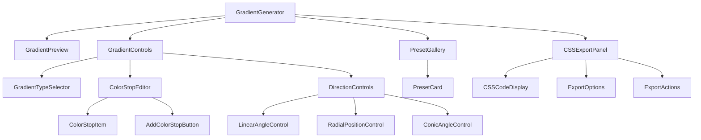
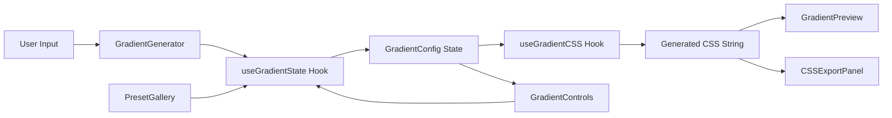
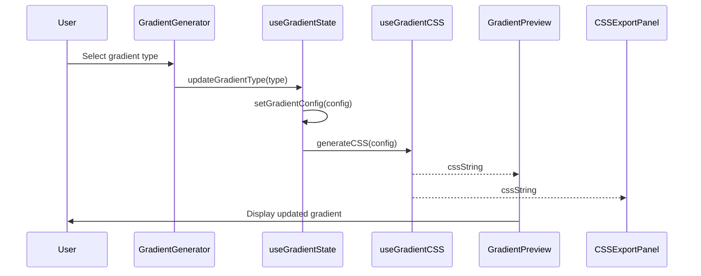

# CSS Gradient Generator - Architecture Design Document

## 1. Overview

This document outlines the architecture for a CSS Gradient Generator component to be integrated into the existing React/TypeScript project at `c:/Users/noone/Documents/Projects/aisoulstudio`. The component will follow the project's established patterns using shadcn/ui components, Zustand for state management, and TypeScript for type safety.

## 2. Component Structure and File Organization

```
components/
├── gradient-generator/
│   ├── index.ts                          # Public API exports
│   ├── GradientGenerator.tsx             # Main container component
│   ├── GradientPreview.tsx               # Live preview visualization
│   ├── GradientControls.tsx              # Main controls wrapper
│   ├── GradientTypeSelector.tsx          # Linear/Radial/Conic selector
│   ├── ColorStopEditor.tsx               # Color stop management
│   ├── DirectionControls.tsx             # Angle/direction controls
│   ├── PresetGallery.tsx                 # Pre-built gradient presets
│   ├── CSSExportPanel.tsx                # CSS code display and export
│   ├── hooks/
│   │   ├── useGradientState.ts           # Custom hook for gradient state
│   │   ├── useGradientCSS.ts             # CSS generation logic
│   │   └── useGradientPresets.ts         # Preset management
│   ├── utils/
│   │   ├── gradientUtils.ts              # Gradient calculation utilities
│   │   ├── colorUtils.ts                 # Color manipulation utilities
│   │   └── cssExportUtils.ts             # CSS export utilities
│   └── types.ts                          # TypeScript type definitions
```

## 3. TypeScript Interfaces and Types

### 3.1 Core Gradient Types

```typescript
// components/gradient-generator/types.ts

/**
 * Supported gradient types
 */
export type GradientType = 'linear' | 'radial' | 'conic';

/**
 * Color stop definition
 */
export interface ColorStop {
  id: string;
  color: string;        // Hex, RGB, or HSL color value
  position: number;     // 0-100 percentage
}

/**
 * Linear gradient configuration
 */
export interface LinearGradientConfig {
  type: 'linear';
  angle: number;        // 0-360 degrees
  colorStops: ColorStop[];
}

/**
 * Radial gradient configuration
 */
export interface RadialGradientConfig {
  type: 'radial';
  shape: 'circle' | 'ellipse';
  position: {
    x: number;         // 0-100 percentage
    y: number;         // 0-100 percentage
  };
  colorStops: ColorStop[];
}

/**
 * Conic gradient configuration
 */
export interface ConicGradientConfig {
  type: 'conic';
  angle: number;        // 0-360 degrees
  position: {
    x: number;         // 0-100 percentage
    y: number;         // 0-100 percentage
  };
  colorStops: ColorStop[];
}

/**
 * Union type for all gradient configurations
 */
export type GradientConfig = 
  | LinearGradientConfig 
  | RadialGradientConfig 
  | ConicGradientConfig;

/**
 * Gradient preset definition
 */
export interface GradientPreset {
  id: string;
  name: string;
  description?: string;
  config: GradientConfig;
  thumbnail?: string;   // Optional preview image
  category?: string;   // For grouping presets
}

/**
 * CSS export format options
 */
export type CSSExportFormat = 'standard' | 'shorthand' | 'legacy';

/**
 * Export options
 */
export interface ExportOptions {
  format: CSSExportFormat;
  includePrefixes: boolean;  // Include vendor prefixes
  includeComments: boolean;  // Include descriptive comments
}
```

### 3.2 Component Props Interfaces

```typescript
/**
 * Main GradientGenerator component props
 */
export interface GradientGeneratorProps {
  /** Initial gradient configuration */
  initialConfig?: GradientConfig;
  /** Callback when gradient changes */
  onGradientChange?: (config: GradientConfig) => void;
  /** Available presets to display */
  presets?: GradientPreset[];
  /** Whether to show the presets panel */
  showPresets?: boolean;
  /** Whether to show the CSS export panel */
  showExportPanel?: boolean;
  /** Custom className for styling */
  className?: string;
  /** Maximum number of color stops allowed */
  maxColorStops?: number;
  /** Minimum number of color stops required */
  minColorStops?: number;
}

/**
 * GradientPreview component props
 */
export interface GradientPreviewProps {
  config: GradientConfig;
  /** Preview dimensions */
  width?: number | string;
  height?: number | string;
  /** Whether to show a checkerboard pattern for transparency */
  showTransparencyGrid?: boolean;
  /** Custom className */
  className?: string;
}

/**
 * ColorStopEditor component props
 */
export interface ColorStopEditorProps {
  colorStops: ColorStop[];
  onColorStopsChange: (stops: ColorStop[]) => void;
  maxStops?: number;
  minStops?: number;
  /** Whether to show position sliders */
  showPositionSliders?: boolean;
}

/**
 * DirectionControls component props
 */
export interface DirectionControlsProps {
  config: GradientConfig;
  onConfigChange: (config: GradientConfig) => void;
  /** Available preset directions for linear gradients */
  presetDirections?: Array<{ label: string; angle: number }>;
}

/**
 * PresetGallery component props
 */
export interface PresetGalleryProps {
  presets: GradientPreset[];
  selectedPresetId?: string;
  onPresetSelect: (preset: GradientPreset) => void;
  /** Whether to show category filters */
  showCategories?: boolean;
  /** Grid layout columns */
  columns?: number;
}

/**
 * CSSExportPanel component props
 */
export interface CSSExportPanelProps {
  config: GradientConfig;
  exportOptions: ExportOptions;
  onExportOptionsChange: (options: ExportOptions) => void;
  /** Callback when copy to clipboard is triggered */
  onCopy?: (css: string) => void;
  /** Callback when download is triggered */
  onDownload?: (css: string, filename: string) => void;
}
```

## 4. Component Hierarchy and Data Flow

### 4.1 Component Hierarchy Diagram



### 4.2 Data Flow Diagram



### 4.3 State Management Flow



## 5. State Management Approach

### 5.1 Local State vs Store Decision

**Decision: Use Local State with Custom Hooks**

The gradient generator should use local state managed through custom hooks rather than the global Zustand store. This is because:

1. **Self-contained functionality**: The gradient generator is a standalone tool that doesn't need to share state with other parts of the application
2. **Multiple instances**: The component may be used in multiple places simultaneously, each with its own gradient state
3. **Performance**: Local state avoids unnecessary re-renders of unrelated components
4. **Simplicity**: The gradient state is complex and specific to this component

### 5.2 Custom Hook: `useGradientState`

```typescript
// components/gradient-generator/hooks/useGradientState.ts

import { useState, useCallback, useMemo } from 'react';
import type { GradientConfig, ColorStop, GradientType } from '../types';

interface UseGradientStateOptions {
  initialConfig?: GradientConfig;
  maxColorStops?: number;
  minColorStops?: number;
  onChange?: (config: GradientConfig) => void;
}

interface UseGradientStateReturn {
  config: GradientConfig;
  gradientType: GradientType;
  colorStops: ColorStop[];
  
  // Actions
  setGradientType: (type: GradientType) => void;
  setColorStops: (stops: ColorStop[]) => void;
  addColorStop: (color?: string, position?: number) => void;
  removeColorStop: (id: string) => void;
  updateColorStop: (id: string, updates: Partial<ColorStop>) => void;
  setLinearAngle: (angle: number) => void;
  setRadialPosition: (x: number, y: number) => void;
  setRadialShape: (shape: 'circle' | 'ellipse') => void;
  setConicAngle: (angle: number) => void;
  setConicPosition: (x: number, y: number) => void;
  setConfig: (config: GradientConfig) => void;
  resetConfig: () => void;
  
  // Computed
  canAddColorStop: boolean;
  canRemoveColorStop: boolean;
}

export function useGradientState(options: UseGradientStateOptions = {}): UseGradientStateReturn {
  const {
    initialConfig,
    maxColorStops = 10,
    minColorStops = 2,
    onChange,
  } = options;

  // Default initial configuration
  const defaultConfig: GradientConfig = {
    type: 'linear',
    angle: 90,
    colorStops: [
      { id: '1', color: '#6366f1', position: 0 },
      { id: '2', color: '#a855f7', position: 100 },
    ],
  };

  const [config, setConfig] = useState<GradientConfig>(initialConfig || defaultConfig);

  // Computed values
  const gradientType = config.type;
  const colorStops = config.colorStops;
  const canAddColorStop = colorStops.length < maxColorStops;
  const canRemoveColorStop = colorStops.length > minColorStops;

  // Actions
  const setGradientType = useCallback((type: GradientType) => {
    setConfig((prev) => {
      const newConfig: GradientConfig = {
        type,
        colorStops: prev.colorStops,
        // Set type-specific defaults
        ...(type === 'linear' && { angle: 90 }),
        ...(type === 'radial' && { 
          shape: 'circle',
          position: { x: 50, y: 50 },
        }),
        ...(type === 'conic' && {
          angle: 0,
          position: { x: 50, y: 50 },
        }),
      };
      onChange?.(newConfig);
      return newConfig;
    });
  }, [onChange]);

  const setColorStops = useCallback((stops: ColorStop[]) => {
    setConfig((prev) => {
      const newConfig = { ...prev, colorStops: stops };
      onChange?.(newConfig);
      return newConfig;
    });
  }, [onChange]);

  const addColorStop = useCallback((color?: string, position?: number) => {
    setConfig((prev) => {
      if (prev.colorStops.length >= maxColorStops) return prev;
      
      const newStop: ColorStop = {
        id: `${Date.now()}-${Math.random()}`,
        color: color || '#ffffff',
        position: position ?? 50,
      };
      
      const newConfig = {
        ...prev,
        colorStops: [...prev.colorStops, newStop].sort((a, b) => a.position - b.position),
      };
      onChange?.(newConfig);
      return newConfig;
    });
  }, [maxColorStops, onChange]);

  const removeColorStop = useCallback((id: string) => {
    setConfig((prev) => {
      if (prev.colorStops.length <= minColorStops) return prev;
      
      const newConfig = {
        ...prev,
        colorStops: prev.colorStops.filter((stop) => stop.id !== id),
      };
      onChange?.(newConfig);
      return newConfig;
    });
  }, [minColorStops, onChange]);

  const updateColorStop = useCallback((id: string, updates: Partial<ColorStop>) => {
    setConfig((prev) => {
      const newConfig = {
        ...prev,
        colorStops: prev.colorStops.map((stop) =>
          stop.id === id ? { ...stop, ...updates } : stop
        ).sort((a, b) => a.position - b.position),
      };
      onChange?.(newConfig);
      return newConfig;
    });
  }, [onChange]);

  const setLinearAngle = useCallback((angle: number) => {
    setConfig((prev) => {
      if (prev.type !== 'linear') return prev;
      const newConfig = { ...prev, angle };
      onChange?.(newConfig);
      return newConfig;
    });
  }, [onChange]);

  const setRadialPosition = useCallback((x: number, y: number) => {
    setConfig((prev) => {
      if (prev.type !== 'radial') return prev;
      const newConfig = { ...prev, position: { x, y } };
      onChange?.(newConfig);
      return newConfig;
    });
  }, [onChange]);

  const setRadialShape = useCallback((shape: 'circle' | 'ellipse') => {
    setConfig((prev) => {
      if (prev.type !== 'radial') return prev;
      const newConfig = { ...prev, shape };
      onChange?.(newConfig);
      return newConfig;
    });
  }, [onChange]);

  const setConicAngle = useCallback((angle: number) => {
    setConfig((prev) => {
      if (prev.type !== 'conic') return prev;
      const newConfig = { ...prev, angle };
      onChange?.(newConfig);
      return newConfig;
    });
  }, [onChange]);

  const setConicPosition = useCallback((x: number, y: number) => {
    setConfig((prev) => {
      if (prev.type !== 'conic') return prev;
      const newConfig = { ...prev, position: { x, y } };
      onChange?.(newConfig);
      return newConfig;
    });
  }, [onChange]);

  const resetConfig = useCallback(() => {
    setConfig(defaultConfig);
    onChange?.(defaultConfig);
  }, [onChange]);

  return {
    config,
    gradientType,
    colorStops,
    setGradientType,
    setColorStops,
    addColorStop,
    removeColorStop,
    updateColorStop,
    setLinearAngle,
    setRadialPosition,
    setRadialShape,
    setConicAngle,
    setConicPosition,
    setConfig,
    resetConfig,
    canAddColorStop,
    canRemoveColorStop,
  };
}
```

### 5.3 Custom Hook: `useGradientCSS`

```typescript
// components/gradient-generator/hooks/useGradientCSS.ts

import { useMemo } from 'react';
import type { GradientConfig, ExportOptions } from '../types';
import { generateGradientCSS } from '../utils/gradientUtils';

interface UseGradientCSSReturn {
  css: string;
  cssWithPrefixes: string;
  getCSS: (options?: ExportOptions) => string;
}

export function useGradientCSS(config: GradientConfig): UseGradientCSSReturn {
  const css = useMemo(() => {
    return generateGradientCSS(config, { format: 'standard', includePrefixes: false, includeComments: false });
  }, [config]);

  const cssWithPrefixes = useMemo(() => {
    return generateGradientCSS(config, { format: 'standard', includePrefixes: true, includeComments: false });
  }, [config]);

  const getCSS = (options?: ExportOptions) => {
    return generateGradientCSS(config, options);
  };

  return { css, cssWithPrefixes, getCSS };
}
```

### 5.4 Custom Hook: `useGradientPresets`

```typescript
// components/gradient-generator/hooks/useGradientPresets.ts

import { useState, useCallback } from 'react';
import type { GradientPreset } from '../types';
import { DEFAULT_PRESETS } from '../utils/presets';

interface UseGradientPresetsReturn {
  presets: GradientPreset[];
  selectedPreset: GradientPreset | null;
  selectPreset: (preset: GradientPreset) => void;
  addPreset: (preset: GradientPreset) => void;
  removePreset: (id: string) => void;
  filterByCategory: (category: string | null) => void;
  categories: string[];
}

export function useGradientPresets(customPresets?: GradientPreset[]): UseGradientPresetsReturn {
  const [presets, setPresets] = useState<GradientPreset[]>([...DEFAULT_PRESETS, ...(customPresets || [])]);
  const [selectedPreset, setSelectedPreset] = useState<GradientPreset | null>(null);
  const [activeCategory, setActiveCategory] = useState<string | null>(null);

  const selectPreset = useCallback((preset: GradientPreset) => {
    setSelectedPreset(preset);
  }, []);

  const addPreset = useCallback((preset: GradientPreset) => {
    setPresets((prev) => [...prev, preset]);
  }, []);

  const removePreset = useCallback((id: string) => {
    setPresets((prev) => prev.filter((p) => p.id !== id));
    if (selectedPreset?.id === id) {
      setSelectedPreset(null);
    }
  }, [selectedPreset]);

  const filterByCategory = useCallback((category: string | null) => {
    setActiveCategory(category);
  }, []);

  const categories = useMemo(() => {
    const cats = new Set(presets.map((p) => p.category).filter(Boolean) as string[]);
    return Array.from(cats);
  }, [presets]);

  const filteredPresets = activeCategory 
    ? presets.filter((p) => p.category === activeCategory)
    : presets;

  return {
    presets: filteredPresets,
    selectedPreset,
    selectPreset,
    addPreset,
    removePreset,
    filterByCategory,
    categories,
  };
}
```

## 6. Integration Points with Existing UI Components

### 6.1 Required shadcn/ui Components

The following shadcn/ui components from [`components/ui/`](components/ui/) will be used:

| Component | Usage |
|-----------|-------|
| [`Button`](components/ui/button.tsx) | Export actions, preset selection, add/remove color stops |
| [`Card`](components/ui/card.tsx) | Container for preview, controls, and export panels |
| [`Slider`](components/ui/slider.tsx) | Angle control, position control, color stop position |
| [`Input`](components/ui/input.tsx) | Custom color input (hex values) |
| [`Label`](components/ui/label.tsx) | Form labels for all controls |
| [`Tabs`](components/ui/tabs.tsx) | Switching between gradient types (optional) |
| [`Select`](components/ui/select.tsx) | Preset dropdown, format selection |
| [`Tooltip`](components/ui/tooltip.tsx) | Help tooltips for controls |
| [`Dialog`](components/ui/dialog.tsx) | Export options modal (optional) |
| [`ScrollArea`](components/ui/scroll-area.tsx) | Preset gallery scrolling |
| [`Badge`](components/ui/badge.tsx) | Category badges for presets |

### 6.2 Component Integration Examples

#### Example: Using Button for Export Actions

```typescript
import { Button } from '@/components/ui/button';
import { Copy, Download } from 'lucide-react';

// In CSSExportPanel.tsx
<Button 
  variant="outline" 
  size="sm"
  onClick={handleCopyToClipboard}
>
  <Copy className="w-4 h-4 mr-2" />
  Copy CSS
</Button>

<Button 
  variant="default" 
  size="sm"
  onClick={handleDownload}
>
  <Download className="w-4 h-4 mr-2" />
  Download
</Button>
```

#### Example: Using Slider for Angle Control

```typescript
import { Slider } from '@/components/ui/slider';
import { Label } from '@/components/ui/label';

// In DirectionControls.tsx
<div className="space-y-2">
  <Label>Angle: {angle}°</Label>
  <Slider
    value={[angle]}
    onValueChange={([value]) => onAngleChange(value)}
    min={0}
    max={360}
    step={1}
    className="w-full"
  />
</div>
```

#### Example: Using Card for Panel Containers

```typescript
import { Card, CardHeader, CardTitle, CardContent } from '@/components/ui/card';

// In GradientGenerator.tsx
<Card>
  <CardHeader>
    <CardTitle>Gradient Preview</CardTitle>
  </CardHeader>
  <CardContent>
    <GradientPreview config={config} />
  </CardContent>
</Card>
```

#### Example: Using Tabs for Gradient Type Selection

```typescript
import { Tabs, TabsList, TabsTrigger, TabsContent } from '@/components/ui/tabs';

// In GradientTypeSelector.tsx
<Tabs value={gradientType} onValueChange={onTypeChange}>
  <TabsList>
    <TabsTrigger value="linear">Linear</TabsTrigger>
    <TabsTrigger value="radial">Radial</TabsTrigger>
    <TabsTrigger value="conic">Conic</TabsTrigger>
  </TabsList>
  <TabsContent value="linear">
    <LinearControls config={config} onChange={onChange} />
  </TabsContent>
  <TabsContent value="radial">
    <RadialControls config={config} onChange={onChange} />
  </TabsContent>
  <TabsContent value="conic">
    <ConicControls config={config} onChange={onChange} />
  </TabsContent>
</Tabs>
```

## 7. Main Component Props Interface

```typescript
/**
 * GradientGenerator - Main component props
 * 
 * @example
 * ```tsx
 * <GradientGenerator
 *   initialConfig={{
 *     type: 'linear',
 *     angle: 135,
 *     colorStops: [
 *       { id: '1', color: '#667eea', position: 0 },
 *       { id: '2', color: '#764ba2', position: 100 },
 *     ],
 *   }}
 *   onGradientChange={(config) => console.log('Gradient changed:', config)}
 *   showPresets={true}
 *   showExportPanel={true}
 *   maxColorStops={8}
 *   minColorStops={2}
 * />
 * ```
 */
export interface GradientGeneratorProps {
  /**
   * Initial gradient configuration
   * @default Two-color linear gradient at 90 degrees
   */
  initialConfig?: GradientConfig;
  
  /**
   * Callback fired when the gradient configuration changes
   * @param config - The new gradient configuration
   */
  onGradientChange?: (config: GradientConfig) => void;
  
  /**
   * Array of custom presets to display alongside defaults
   */
  presets?: GradientPreset[];
  
  /**
   * Whether to show the presets panel
   * @default true
   */
  showPresets?: boolean;
  
  /**
   * Whether to show the CSS export panel
   * @default true
   */
  showExportPanel?: boolean;
  
  /**
   * Custom className for the root container
   */
  className?: string;
  
  /**
   * Maximum number of color stops allowed
   * @default 10
   */
  maxColorStops?: number;
  
  /**
   * Minimum number of color stops required
   * @default 2
   */
  minColorStops?: number;
  
  /**
   * Whether to enable animation on the preview
   * @default false
   */
  enableAnimation?: boolean;
  
  /**
   * Animation duration in seconds (when enabled)
   * @default 3
   */
  animationDuration?: number;
}
```

## 8. Utility Functions

### 8.1 Gradient Utilities

```typescript
// components/gradient-generator/utils/gradientUtils.ts

import type { GradientConfig, ExportOptions } from '../types';

/**
 * Generate CSS gradient string from configuration
 */
export function generateGradientCSS(
  config: GradientConfig,
  options: ExportOptions = { format: 'standard', includePrefixes: false, includeComments: false }
): string {
  const { format, includePrefixes, includeComments } = options;
  
  const colorStops = config.colorStops
    .map((stop) => `${stop.color} ${stop.position}%`)
    .join(', ');
  
  let gradient = '';
  
  switch (config.type) {
    case 'linear':
      gradient = `linear-gradient(${config.angle}deg, ${colorStops})`;
      break;
    case 'radial':
      gradient = `radial-gradient(${config.shape} at ${config.position.x}% ${config.position.y}%, ${colorStops})`;
      break;
    case 'conic':
      gradient = `conic-gradient(from ${config.angle}deg at ${config.position.x}% ${config.position.y}%, ${colorStops})`;
      break;
  }
  
  let css = `background: ${gradient};`;
  
  if (includePrefixes && config.type === 'linear') {
    css = `-webkit-linear-gradient(${config.angle}deg, ${colorStops});\n` +
          `-moz-linear-gradient(${config.angle}deg, ${colorStops});\n` +
          `-o-linear-gradient(${config.angle}deg, ${colorStops});\n` +
          `background: ${gradient};`;
  }
  
  if (includeComments) {
    css = `/* ${config.type.charAt(0).toUpperCase() + config.type.slice(1)} Gradient */\n` + css;
  }
  
  return css;
}

/**
 * Validate gradient configuration
 */
export function validateGradientConfig(config: GradientConfig): {
  valid: boolean;
  errors: string[];
} {
  const errors: string[] = [];
  
  if (config.colorStops.length < 2) {
    errors.push('At least 2 color stops are required');
  }
  
  if (config.colorStops.length > 10) {
    errors.push('Maximum 10 color stops allowed');
  }
  
  for (const stop of config.colorStops) {
    if (stop.position < 0 || stop.position > 100) {
      errors.push(`Color stop position must be between 0 and 100`);
    }
    if (!isValidColor(stop.color)) {
      errors.push(`Invalid color: ${stop.color}`);
    }
  }
  
  if (config.type === 'linear') {
    if (config.angle < 0 || config.angle > 360) {
      errors.push('Linear angle must be between 0 and 360');
    }
  }
  
  if (config.type === 'radial' || config.type === 'conic') {
    if (config.position.x < 0 || config.position.x > 100) {
      errors.push('Position X must be between 0 and 100');
    }
    if (config.position.y < 0 || config.position.y > 100) {
      errors.push('Position Y must be between 0 and 100');
    }
  }
  
  return { valid: errors.length === 0, errors };
}

/**
 * Check if a color string is valid
 */
export function isValidColor(color: string): boolean {
  const s = new Option().style;
  s.color = color;
  return s.color !== '';
}

/**
 * Convert gradient config to a unique hash for comparison
 */
export function gradientConfigToHash(config: GradientConfig): string {
  return JSON.stringify(config);
}
```

### 8.2 Color Utilities

```typescript
// components/gradient-generator/utils/colorUtils.ts

/**
 * Convert hex color to RGB
 */
export function hexToRgb(hex: string): { r: number; g: number; b: number } | null {
  const result = /^#?([a-f\d]{2})([a-f\d]{2})([a-f\d]{2})$/i.exec(hex);
  return result
    ? {
        r: parseInt(result[1], 16),
        g: parseInt(result[2], 16),
        b: parseInt(result[3], 16),
      }
    : null;
}

/**
 * Convert RGB to hex
 */
export function rgbToHex(r: number, g: number, b: number): string {
  return '#' + [r, g, b].map((x) => {
    const hex = x.toString(16);
    return hex.length === 1 ? '0' + hex : hex;
  }).join('');
}

/**
 * Get contrasting text color (black or white) for a given background
 */
export function getContrastColor(hex: string): 'black' | 'white' {
  const rgb = hexToRgb(hex);
  if (!rgb) return 'black';
  
  const luminance = (0.299 * rgb.r + 0.587 * rgb.g + 0.114 * rgb.b) / 255;
  return luminance > 0.5 ? 'black' : 'white';
}

/**
 * Generate a random color
 */
export function randomColor(): string {
  return '#' + Math.floor(Math.random() * 16777215).toString(16).padStart(6, '0');
}

/**
 * Interpolate between two colors
 */
export function interpolateColor(color1: string, color2: string, factor: number): string {
  const rgb1 = hexToRgb(color1);
  const rgb2 = hexToRgb(color2);
  
  if (!rgb1 || !rgb2) return color1;
  
  const r = Math.round(rgb1.r + factor * (rgb2.r - rgb1.r));
  const g = Math.round(rgb1.g + factor * (rgb2.g - rgb1.g));
  const b = Math.round(rgb1.b + factor * (rgb2.b - rgb1.b));
  
  return rgbToHex(r, g, b);
}
```

### 8.3 CSS Export Utilities

```typescript
// components/gradient-generator/utils/cssExportUtils.ts

import type { GradientConfig, ExportOptions } from '../types';
import { generateGradientCSS } from './gradientUtils';

/**
 * Generate CSS with class wrapper
 */
export function generateCSSWithClass(
  config: GradientConfig,
  className: string = 'gradient-bg',
  options: ExportOptions = { format: 'standard', includePrefixes: false, includeComments: true }
): string {
  const gradientCSS = generateGradientCSS(config, options);
  
  return `.${className} {
  ${gradientCSS}
}`;
}

/**
 * Generate CSS with inline style
 */
export function generateInlineStyle(config: GradientConfig): string {
  const gradientCSS = generateGradientCSS(config, { 
    format: 'standard', 
    includePrefixes: false, 
    includeComments: false 
  });
  return gradientCSS.replace('background: ', '').replace(';', '');
}

/**
 * Download CSS as a file
 */
export function downloadCSSFile(css: string, filename: string = 'gradient.css'): void {
  const blob = new Blob([css], { type: 'text/css' });
  const url = URL.createObjectURL(blob);
  const link = document.createElement('a');
  link.href = url;
  link.download = filename;
  document.body.appendChild(link);
  link.click();
  document.body.removeChild(link);
  URL.revokeObjectURL(url);
}

/**
 * Copy CSS to clipboard
 */
export async function copyCSSToClipboard(css: string): Promise<boolean> {
  try {
    await navigator.clipboard.writeText(css);
    return true;
  } catch (error) {
    console.error('Failed to copy CSS to clipboard:', error);
    return false;
  }
}
```

### 8.4 Default Presets

```typescript
// components/gradient-generator/utils/presets.ts

import type { GradientPreset } from '../types';

export const DEFAULT_PRESETS: GradientPreset[] = [
  {
    id: 'sunset',
    name: 'Sunset',
    description: 'Warm orange to purple gradient',
    category: 'Warm',
    config: {
      type: 'linear',
      angle: 135,
      colorStops: [
        { id: '1', color: '#ff7e5f', position: 0 },
        { id: '2', color: '#feb47b', position: 100 },
      ],
    },
  },
  {
    id: 'ocean',
    name: 'Ocean',
    description: 'Deep blue to cyan gradient',
    category: 'Cool',
    config: {
      type: 'linear',
      angle: 180,
      colorStops: [
        { id: '1', color: '#2193b0', position: 0 },
        { id: '2', color: '#6dd5ed', position: 100 },
      ],
    },
  },
  {
    id: 'forest',
    name: 'Forest',
    description: 'Green nature gradient',
    category: 'Nature',
    config: {
      type: 'linear',
      angle: 45,
      colorStops: [
        { id: '1', color: '#134e5e', position: 0 },
        { id: '2', color: '#71b280', position: 100 },
      ],
    },
  },
  {
    id: 'neon',
    name: 'Neon',
    description: 'Vibrant purple to pink gradient',
    category: 'Vibrant',
    config: {
      type: 'linear',
      angle: 90,
      colorStops: [
        { id: '1', color: '#667eea', position: 0 },
        { id: '2', color: '#764ba2', position: 100 },
      ],
    },
  },
  {
    id: 'midnight',
    name: 'Midnight',
    description: 'Dark blue to black gradient',
    category: 'Dark',
    config: {
      type: 'linear',
      angle: 180,
      colorStops: [
        { id: '1', color: '#0f2027', position: 0 },
        { id: '2', color: '#203a43', position: 50 },
        { id: '3', color: '#2c5364', position: 100 },
      ],
    },
  },
  {
    id: 'aurora',
    name: 'Aurora',
    description: 'Northern lights inspired gradient',
    category: 'Nature',
    config: {
      type: 'linear',
      angle: 120,
      colorStops: [
        { id: '1', color: '#00c6ff', position: 0 },
        { id: '2', color: '#0072ff', position: 100 },
      ],
    },
  },
  {
    id: 'candy',
    name: 'Candy',
    description: 'Sweet pink and orange gradient',
    category: 'Warm',
    config: {
      type: 'linear',
      angle: 45,
      colorStops: [
        { id: '1', color: '#ff9a9e', position: 0 },
        { id: '2', color: '#fecfef', position: 100 },
      ],
    },
  },
  {
    id: 'cosmic',
    name: 'Cosmic',
    description: 'Space-inspired purple gradient',
    category: 'Dark',
    config: {
      type: 'radial',
      shape: 'circle',
      position: { x: 50, y: 50 },
      colorStops: [
        { id: '1', color: '#667eea', position: 0 },
        { id: '2', color: '#764ba2', position: 100 },
      ],
    },
  },
];
```

## 9. Accessibility Considerations

### 9.1 Keyboard Navigation

- All interactive elements must be keyboard accessible
- Slider controls should support arrow keys for fine-tuning
- Color pickers should be accessible via keyboard
- Preset cards should be focusable and selectable via Enter/Space

### 9.2 Screen Reader Support

- Provide ARIA labels for all controls
- Announce gradient changes to screen readers
- Include descriptive text for color stops
- Use semantic HTML elements

### 9.3 Color Contrast

- Ensure text labels have sufficient contrast against backgrounds
- Provide alternative indicators for color information (e.g., hex values)
- Support high contrast mode

### 9.4 Focus Management

- Maintain visible focus indicators
- Logical tab order through controls
- Focus trapping in modals (if used)

### 9.5 Accessibility Implementation Examples

```typescript
// Example: Accessible Slider Control
<div className="space-y-2">
  <Label htmlFor="angle-slider">Angle: {angle}°</Label>
  <Slider
    id="angle-slider"
    value={[angle]}
    onValueChange={([value]) => onAngleChange(value)}
    min={0}
    max={360}
    step={1}
    aria-label="Gradient angle in degrees"
    aria-valuemin={0}
    aria-valuemax={360}
    aria-valuenow={angle}
    className="w-full"
  />
</div>

// Example: Accessible Color Stop
<button
  type="button"
  className="color-stop-button"
  aria-label={`Color stop at ${position}%, color ${color}`}
  onClick={() => onEdit(stop.id)}
  onKeyDown={(e) => {
    if (e.key === 'Enter' || e.key === ' ') {
      e.preventDefault();
      onEdit(stop.id);
    }
  }}
>
  <div 
    className="color-preview"
    style={{ backgroundColor: color }}
    aria-hidden="true"
  />
</button>

// Example: Accessible Preset Card
<button
  type="button"
  className="preset-card"
  onClick={() => onSelect(preset)}
  aria-label={`Select ${preset.name} preset: ${preset.description}`}
  aria-pressed={isSelected}
>
  <div 
    className="preset-preview"
    style={{ background: generateGradientCSS(preset.config) }}
    aria-hidden="true"
  />
  <span className="preset-name">{preset.name}</span>
</button>
```

## 10. Component Implementation Notes

### 10.1 Main Component Structure

```typescript
// components/gradient-generator/GradientGenerator.tsx

import React from 'react';
import { cn } from '@/lib/utils';
import { useGradientState } from './hooks/useGradientState';
import { useGradientCSS } from './hooks/useGradientCSS';
import { GradientPreview } from './GradientPreview';
import { GradientControls } from './GradientControls';
import { PresetGallery } from './PresetGallery';
import { CSSExportPanel } from './CSSExportPanel';
import type { GradientGeneratorProps } from './types';

export function GradientGenerator({
  initialConfig,
  onGradientChange,
  presets,
  showPresets = true,
  showExportPanel = true,
  className,
  maxColorStops = 10,
  minColorStops = 2,
  enableAnimation = false,
  animationDuration = 3,
}: GradientGeneratorProps) {
  const gradientState = useGradientState({
    initialConfig,
    maxColorStops,
    minColorStops,
    onChange: onGradientChange,
  });

  const { config } = gradientState;
  const { css } = useGradientCSS(config);

  return (
    <div className={cn('gradient-generator', className)}>
      {/* Preview Section */}
      <GradientPreview 
        config={config} 
        enableAnimation={enableAnimation}
        animationDuration={animationDuration}
      />

      {/* Controls Section */}
      <GradientControls state={gradientState} />

      {/* Presets Section */}
      {showPresets && (
        <PresetGallery 
          presets={presets}
          onSelect={(preset) => gradientState.setConfig(preset.config)}
        />
      )}

      {/* Export Section */}
      {showExportPanel && (
        <CSSExportPanel 
          config={config}
          css={css}
        />
      )}
    </div>
  );
}

export default GradientGenerator;
```

### 10.2 Export Index

```typescript
// components/gradient-generator/index.ts

export { GradientGenerator } from './GradientGenerator';
export { GradientPreview } from './GradientPreview';
export { GradientControls } from './GradientControls';
export { GradientTypeSelector } from './GradientTypeSelector';
export { ColorStopEditor } from './ColorStopEditor';
export { DirectionControls } from './DirectionControls';
export { PresetGallery } from './PresetGallery';
export { CSSExportPanel } from './CSSExportPanel';

export { useGradientState } from './hooks/useGradientState';
export { useGradientCSS } from './hooks/useGradientCSS';
export { useGradientPresets } from './hooks/useGradientPresets';

export type {
  GradientType,
  ColorStop,
  LinearGradientConfig,
  RadialGradientConfig,
  ConicGradientConfig,
  GradientConfig,
  GradientPreset,
  CSSExportFormat,
  ExportOptions,
  GradientGeneratorProps,
  GradientPreviewProps,
  ColorStopEditorProps,
  DirectionControlsProps,
  PresetGalleryProps,
  CSSExportPanelProps,
} from './types';
```

## 11. Summary of Design Decisions

| Decision | Rationale |
|----------|-----------|
| **Local state with custom hooks** | Self-contained functionality, supports multiple instances, better performance |
| **Separate utility files** | Reusability, testability, and maintainability |
| **TypeScript interfaces for all props** | Type safety, better IDE support, documentation |
| **shadcn/ui components** | Consistency with existing project, accessibility built-in |
| **Modular component structure** | Easier to maintain, test, and extend |
| **Default presets included** | Quick start for users, demonstrates capabilities |
| **Multiple export formats** | Flexibility for different use cases |
| **Accessibility-first approach** | Inclusive design, WCAG compliance |
| **Animation support optional** | Performance consideration, user preference |
| **Configurable constraints** | Flexibility for different use cases |

## 12. Future Enhancement Opportunities

1. **Gradient Animation Editor**: Add keyframe-based animation controls
2. **Gradient Import/Export**: Save and load gradient configurations as JSON
3. **Gradient Blending Modes**: Support for blend-mode overlays
4. **Gradient Mesh**: Advanced mesh gradient support
5. **AI Gradient Suggestions**: Suggest gradients based on color theory
6. **Gradient History**: Undo/redo functionality
7. **Gradient Comparison**: Side-by-side comparison of multiple gradients
8. **Responsive Presets**: Presets that adapt to different screen sizes
9. **Gradient Templates**: Pre-built gradient templates for common use cases
10. **Integration with Design Tools**: Export to Figma/Sketch formats
